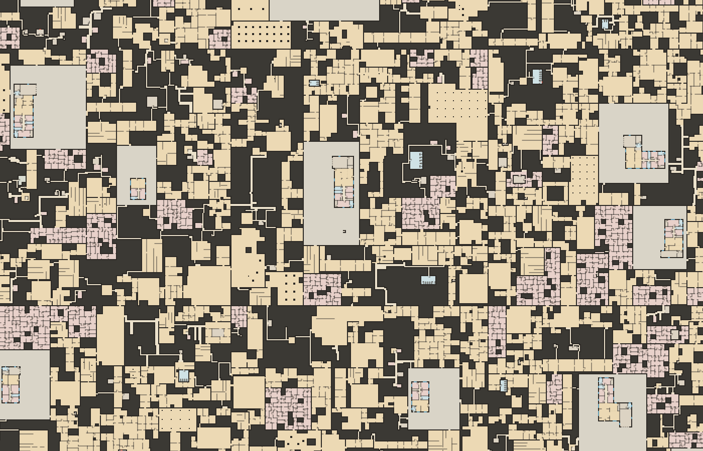

# Backrooms map prototype

An infinite, deterministic 2-D Backrooms map, built entirely from templates.
Open `index.html` in a browser. There is no build step and no runtime
dependency.



Every site on the plane is built by a template from its outline and its
connections:

- **Fillers** build the plain Backrooms: warrens, winding passages, chains of
  rooms, cell clusters, rings, broken rooms, and the occasional open hall.
- **POI templates** build the places that should feel designed (houses,
  closets, restrooms, storage). A house stands toward the back of its own lot,
  in a big yard room. A template at least 8 m across can be a lot of its own
  with its door on the edge, and a smaller one sits inside a filler.

The world itself only decides where the sites are and how they connect.

## The world

The plane is cut into 128 m cells. Each cell is planned from the seed and its
own coordinates, so any part of the map comes out the same in any order:

1. Each cell border gets 2–4 openings, which both cells agree on.
2. POIs claim their places: houses and block-sized templates get lots, and
   smaller ones go inside what will be filler sites.
3. Every lot is cut out as a site of its own. The rest of the cell is cut
   into 8–32 m blocks around them. Some blocks merge into L, T and Z sites,
   and the sites tile the cell with no gaps.
4. A spanning tree of exact openings joins the sites, plus a few loops. The
   border openings join the cells, so the whole map is one connected graph.
5. Each site is built from its connections: a filler from the pool (built
   round any small POI inside it), a house in its yard, or a flush building
   whose doors are the connections.

A slow biome field tilts the filler weights between deep warrens and open
stretches. Unbuilt cells are solid, so the map is mostly enclosed, with open
space now and then.

[How the world is planned and built, measured](docs/world.md)

## Templates

A template takes any rectilinear site, its connections or main side, and a
seed. It returns a **blueprint** on a 0.5 m kit grid: rooms with types and
tags, walls, doors, windows, portals, levels and a room graph. Templates output
no furniture.

- **House** (ranch, bungalow, split ranch, suburban) and **Rooms & small
  POIs** (closet, storage room, restroom, mechanical room, storage units).
  [Contract, pipeline and how to add archetypes](docs/templates.md)
- **Fillers**: a pool of eight Backrooms fillers, weighted 70 / 20 / 10
  enclosed / mixed / open, plus the yard round a house. Each builds a site in about
  2 ms and honours every connection exactly.
  [Filler pool, contract and pipeline](docs/fillers.md)

Open `workbench.html` to:

- browse, search and health-check every template and filler;
- page through seeds;
- compare templates side by side;
- try sites and connections;
- edit recipes;
- export the JSON.

## Controls (`index.html`)

| Control | Function |
|---|---|
| Drag / WASD / arrow keys | Pan; Shift is faster |
| Wheel / pinch / `+` / `-` | Zoom. Blueprints from 1 px/m, room labels in POIs from 7 px/m |
| Go to | Enter `x, y` |
| Site outlines / Connection graph | Show the sites and the graph between them |
| Hover | The site's template, size, connections, biome and build time; the POI, its setting and its doors |

The URL hash keeps the seed, position, zoom and toggles, for example
`#seed=31337&x=20&y=70&z=9&graph=1`.

## Modules

| Module | Responsibility |
|---|---|
| `core.js` | Seeded hashing, PRNG, noise, union-find |
| `poi.js` | POI placement per cell: tiers, density rhythm, settings (yard lots, flush lots, inside fillers), sheds, clusters, sites; `buildPOI` |
| `world.js` | Cell plans (borders, blocks, sites, connection graph), site builds, bounded caches, queries |
| `render.js` | The map: tile cache, detail / plan / far views, overlays |
| `tpl/` | The template system: kit grid, framework, House and Rooms engines, archetypes, fillers, lots (`lot.js`: settings, the yard, and the adapter that builds templates inside bigger ones), blueprint renderer |

```js
const W = new BR.World(31337);
const s = W.siteAt(20, 70);   // the site at a point
W.build(s);                   // its blueprints: the filler or yard and any POI buildings
W.cell(0, 0).conns;           // the connection graph of a cell
```

## Verification

```sh
node tests/run-all.js
```

The runner checks:

- **Templates.** Every archetype builds on many seeds, sites and main sides,
  and keeps the blueprint contract.
- **Fillers.** Every filler keeps the contract on any site shape and honours
  every connection. The pool leans enclosed, and fillers are fast.
- **The world, on five seeds.** Sites tile every cell exactly. Connections are
  exact openings on shared lines, and the cells agree on their borders. The
  plan is the same in any order and with a tiny cache. Every site builds with
  no problems, every connection is cut on both sides, and every room in a
  3 × 3 cell region (POI rooms included) is reachable. Every lot is its own
  site, a house stands toward the back of its yard and is entered from the
  front, and a flush lot is joined only through its doors. The rest of the
  POI placement rules are checked too.
- **The map page.** It runs `index.html`'s controller with a stub canvas.

There is no CI yet; run the checks before pushing.
