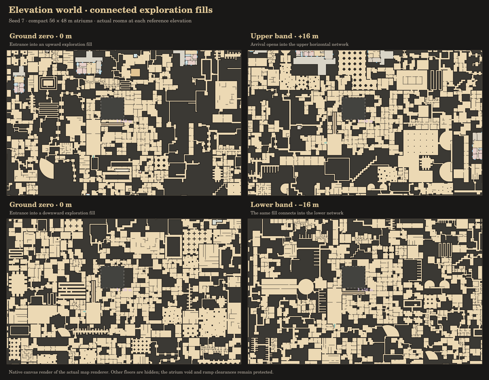

# Elevation world — milestone 2

The main map now generates connected horizontal networks above and below ground
zero. A rare **terraced atrium fill** is planned with both band territories and
its physical journey together. Its openings connect to real rooms in the world.



## Inspect the map

Open `index.html`. No build step or runtime dependencies are required.

- **Band −/+ and band menu:** inspect another horizontal network at the same XY.
  These controls change the view; they are not player traversal actions.
- **Find up fill / Find down fill:** center the nearest planned exploration fill.
- **Floor menu:** inspect actual elevations within a shared fill, independently
  of its home band. Selecting a non-reference slice zooms into blueprint detail.
- **Ghost other floors:** show overlapping floors faintly within a vertical fill.
- **Connection graph:** inspect horizontal site connections in the selected band.
  The fill drawings also show physical ramps and their heights.
- **Export this cell · 3 bands:** download the cell under the view center for the
  selected band and its neighbors, including complete shared fill geometry.

Band, floor, ghost setting, seed and XY/zoom are saved in the URL hash. For
example, `#seed=7&band=1&floor=-4` inspects +12 m while the planning context is
the +16 m reference band. Purple plan sites and ↕ markers identify journeys.
Hover shows shared ownership, bands, floor and clear height.

At plan/far zoom, the map shows territories and biome context. Floor geometry
is inspected at detail zoom; empty room slices can still contain ramps. Tile
caches include band, floor and ghost settings, including coarser fallbacks.

## Deterministic planning

`src/band-world.js` adds `BR.BandWorld` around the existing `BR.World`. Each
band uses its own deterministic seed and the existing 128 m cell planner;
ground zero retains the original seed. The flat generator remains available.

| Initial policy | Value | Purpose |
| --- | --- | --- |
| Reference spacing | 16 m | Accommodates existing tall street/neighborhood halls and slabs |
| Journey region | 4 × 4 cells, 512 × 512 m | One journey per region per adjacent pair |
| Shared fill territory | 56 × 48 m | Four 4 m rises with ramps no steeper than 1:4 |
| Ordinary envelope | Reference −0.25 m to +15.5 m | Conservative room/slab reservation |
| Shared envelope | Lower reference −0.25 m to upper reference +3 m | Protects rooms, ramps, stacked pocket and atrium |

These are initial policy values, not mandatory room heights or final game band
spacing. Most rooms keep their existing ceilings; ordinary ground routes stay
at zero. Intermediate heights belong to exploration fills. Broader local floor
variation is M3.

For each pair `(n,n+1)` and region `(ri,rj)`, the base seed selects one shared
owner, cell, footprint and blueprint. Even/odd pairs use opposite X halves of
a region, so neighboring up/down journeys never compete for a cell. Negative
coordinates use floor division. Bands can be inspected on demand in both
directions; integer indices are bounded to ±10,000 as an API guard.

The territory is carved into a reserved central site and four surrounding
strips before random block subdivision. Outer strip cuts avoid both bands'
border openings. POIs honor the claim and retain clearance from new subdivision
boundaries, preserving usable doors for small templates.

Each reserved site connects horizontally only at its authored portal at that
band's reference height. The existing spanning tree connects surrounding sites;
the fill is excluded from arbitrary horizontal loop cuts. The other band's
portal is on a different XY edge and Z, reached through the rooms and ramps.

At +14 m the stacked pocket still belongs to the lower home band; its ceiling
occupies +16 m space, but it has no upper network portal. Only the authored
arrival at +16 m supplies that connection. Occupancy never implies connectivity.

### Compact populated atrium

The world variant now claims **2,688 m² instead of 5,760 m²**, a 53.3% reduction.
Both reference floors contain connected enclosed room networks around the
authored vertical journey. These use the existing `warren` filler pipeline,
with 2.4 m clear ceilings and real internal openings into the entrance/gallery
and arrival. The four ramps, intermediate rooms, stacked pocket and atrium
remain part of the same shared owner, with exactly two external band portals.

Infill excludes the existing room/slab, ramp headroom and void volumes that
intersect its floor height. It can fit underneath an elevated gallery when
there is enough clearance. It cannot occupy the atrium or a ramp's reserved
space. Neighboring territories still stay outside the full shared envelope;
this change fills out the template itself. Some solid mass between rooms is
intentional, as with ordinary enclosed fills.

The preview above hides other floors to show the usable reference-floor plans.
The standalone M1 lab fixture retains its minimal authored geometry; the world
requests the populated form through `ELEV.generate({ ..., infill: true })`.

## Ownership, reservations and caches

Ordinary IDs include their band, such as `b-1|-2,1:12`. Both appearances of a
journey share an owner such as `journey:-1:-1,0` and the same complete physical
blueprint. A slice binds only its own horizontal portal. Combined exports emit
shared surfaces, connectors and reservations once.

`reservationPlan(i,j,minBand,maxBand)` reconstructs a local atomic reservation
index from planned ownership. Rooms, slabs, connector headroom and protected
voids fit their owner's envelope. Child POI layouts identify their containing
site through `reservationOwner`.

Reservations are not accumulated as chunks arrive; eviction cannot release
space to another owner. Band, cell, build, claim, transition and tile caches
are bounded and hold reproducible results. Upper-first generation, remote
exploration and eviction produce identical geometry and canonical export.
Wall-clock timing diagnostics are excluded from exports.
Map rendering uses the original ordinary blueprints with their band offset.
`world.spatial(site)` caches the full explicit-Z adapter on demand for navigation
and export, without modifying the original. It defers optional ladder searches.
Exports materialize physical up/down candidates, and `ELEV.prepare(blueprint)`
materializes them when requested directly. Selected journeys remain fully
physical during rendering; required geometry and navigation are never deferred.

An ordinary blueprint exceeding its planned envelope is rejected, rather than
shortened. Taller ordinary fills crossing bands require authored shared claims
in M3. The initial envelopes conservatively reserve unused vertical space too.

## Spatial graph and export

The experimental world schema is **`br.world-elevation/0.1`**, metres, XY
horizontal and Z up. Layout XY coordinates are local to the supplied world XY
`origin`; their Z values are already absolute world heights. Portal positions
are world XYZ. Layouts embed M1 `br.elevation/0.1` blueprints.

| Field | Meaning |
| --- | --- |
| `bands` | Requested reference IDs/elevations |
| `slices` | Per-band cell ownership and horizontal connection plans |
| `layouts` | Unique owner, reservation owner, XY origin and full blueprint |
| `reservations` | World XYZ envelopes, including protected shared space |
| `navigation` | Authoritative surface nodes and directed traversal edges |
| `portalMatches` | Real paired openings: world XYZ, width, facing and usable headroom |
| `frontier` | Horizontal openings leaving the requested cell region |
| `verticalFrontier` | Known shared-fill landings into an unrequested band |
| `unresolved` | Legacy abstract links needing authored physical paths |

Matching requires equal XYZ and width, opposite facing sides, and at least
1.8 m usable headroom per endpoint. Mismatches and missing internal endpoints
are issues; export rejects an invalid connection set. Occupancy, ghosts and
the legacy `outside` node supply no edges. Traversal honors direction; current
journeys are bidirectional.

```js
const world = new BR.BandWorld(7);
world.setBand(-1);
const p = world.nearestTransition('up', 0, 0);
const data = world.exportRegion(p.i, p.j, p.i, p.j, [-1, 0]);
const graph = world.graph(0, 0, 3, 3, [-1, 0, 1]);
```

Export is limited to 64 band cells to bound synchronous inspection work. A
complete shared fill can extend outside the requested bands; `verticalFrontier`
marks the unrequested network entrance without inventing an edge. This is a
consumer prototype, not an Unreal importer. Procedural seam decorations remain
within ordinary bands; planned portals establish required connectivity. Shared
fills exclude accidental seam cuts.

## Validation and remaining work

`node tests/run-all.js` includes existing flat regressions and:

- 6,000 journey placements across 100 seeds: deterministic ownership, negative
  regions, adjacent-pair separation and both bands' border clearance.
- 100 compact populated atriums in both directions: real 1 m walker access
  through the rooms and doors on both reference floors, exact headroom/void
  exclusion, deterministic exports, and a single shared owner. At least 55%
  of each reference-floor claim is walkable room area; rooms, ramps and the
  atrium together account for at least 90% of claimed XY across all heights.
- 60 complete journeys across three seeds: all rooms reachable, destination
  first generation, exact tiling, shared voids and occupancy without a portal.
- Full three-band regions for seeds 7 and 99: all rooms reachable, with over
  1,000 horizontal connections each.
- Identical canonical exports after reversed generation, remote exploration,
  cell/build eviction and whole-band eviction with one-entry caches. All
  exported physical volumes fit their planned 3D envelopes.
- Rejection of wrong portal height/width/facing/headroom, missing endpoints,
  invalid bands/export size and ramps too steep for their site.
- Actual map controller interactions and export with a DOM/canvas adapter;
  actual tile renderer floor selection, ramp-only slices and cache isolation
  with a canvas adapter. Native canvas previews are inspected visually. These
  checks are not browser-engine layout tests.

This completes M2. M3 adds authored template variety, depressed/raised floors,
pits with traversal rules, more varied shared territories and tuning of major
transition spacing. Every template retains M1 optional up/down potential. The
automatic world currently selects terraced atriums for major transitions, with
a small ladder internal to each compact pocket. M4 is the Unreal consumer proof.
