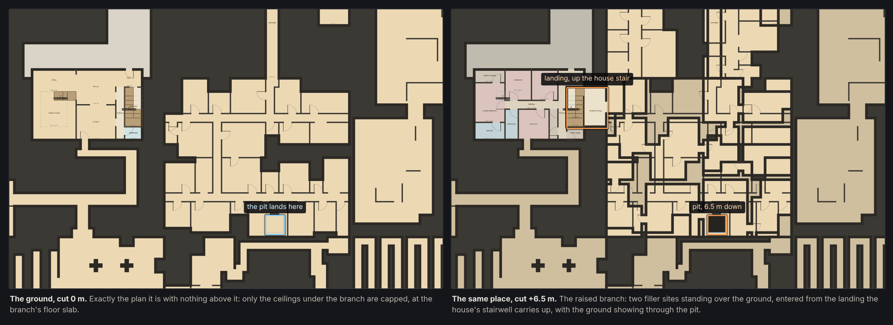
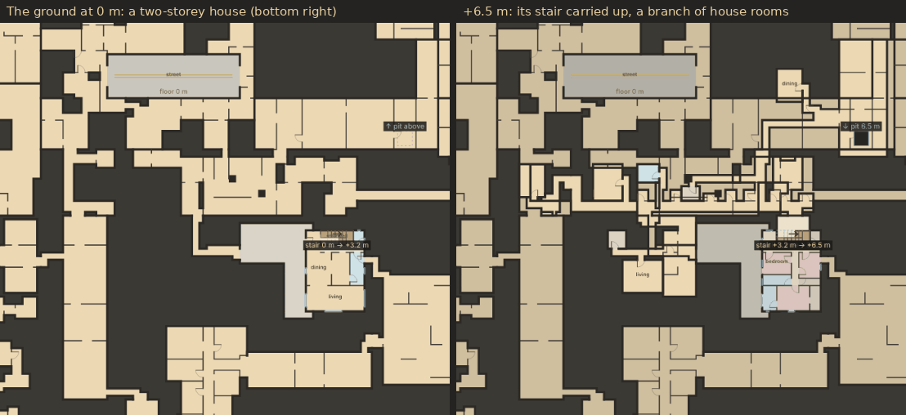

# Elevation world and cutaway inspection

`BR.BandWorld` wraps the deterministic template world with independently seeded
horizontal reference bands above and below ground zero, joined by **journeys**
(milestone 4, [the plan](elevation.md)): in every 512 × 512 m region, one
territory per pair of neighbouring bands holds a stack of different fillers
climbing from the lower band's floor to the upper band's, 16 m up. Neighbouring
bands are one network. Every other template keeps its up/down potential:
exported layouts list their connection zones (ladder, stair, ramp),
unselected, and the lab builds connected variants of any of them.

A world column can hold several owners stacked at different heights
(milestone 5): a ground site keeps its own floor with its ceiling capped, and a
**raised branch** above it owns everything from its floor slab up to the band's
ceiling. See [Layered ownership](#layered-ownership-claims-raised-branches-and-pits).

## Inspect the map

- Band −/+ and the band menu inspect another horizontal network at the same XY.
  Switching bands resets the cut to that band's reference height.
- Cutaway height shows the highest floor at or below the chosen height at each
  XY within the active band's blueprints. Uncovered lower floors remain visible
  and become darker with depth. This is a schematic view, not a physical section
  through room ceilings.
- Click a template at detail zoom to open its actual local floor choices.
  Selecting a floor moves the cut to that height. Upper-floor ghosting applies
  only to the selected template. Clear selection removes this focus.
- Template JSON downloads the selected instance, its XY origin and explicit
  absolute floor/ceiling heights. It does not regenerate a sample approximation.
- Export this cell · 3 bands downloads spatial data for the centered cell in
  the active band and its two neighbors, joined wherever a journey's territory
  lies in the cell.
- Journey ↓ / Journey ↑ centre the view on the nearest journey down or up from
  the active band. At plan zoom journey territories are teal; hovering one names
  its bands, style and floors. At detail zoom the cutaway shows the journey's
  floor at the cut height: slide the cut to climb it, or switch band to see its
  top.
- A raised branch is painted with the ground at detail zoom, at its own floor
  height: below its floor it shows nothing, at or above it the ground below
  shows through its pit. Hovering it names it `raised branch · <filler>` and
  gives the pit's drop; hovering the ground under it says a claim stands over
  this ground, at what height, and where this site's own ceiling now is. At plan
  zoom its footprint is tinted.
- Connection graph shows horizontal site connectivity in the active band.

Seed, XY/zoom, band, cut height and display toggles stay in the URL, for example
`#seed=7&band=1&cut=18.125&z=4`. Template selection is temporary and clears when
changing seed or band. Older `floor` offsets are read once as a height offset
from the band reference. Plan/far zoom still shows territory and biome context.

The standalone [elevation lab](../elevation.html) offers both continuous cutaway
and exact local floor inspection. Ramp/stair footprints use their width and XYZ
path; no extra floor entries are created by sloped paths or tall ceilings.
Connections show landing heights, continuation above the cut and the destination
outline in both directions. Clicking the footprint reveals its other landing.

## Current planning and reservations

| Policy | Value | Purpose |
| --- | --- | --- |
| Reference spacing | 16 m | Fits existing tall halls and slabs |
| Ordinary envelope | Reference −1.5 m to +14.5 m | Room/slab ownership: a sunken floor down to −1.25 m (plus its slab) up to a 14 m street ceiling; 16 m in all, so bands never overlap |
| World vertical journeys | One per band pair per 512 m region (4 × 4 cells) | A territory of 40-56 × 32-48 m in one cell; even pairs in the region's west half, odd pairs in its east half; three doors onto each band |
| Journey envelope | Lower reference −1.5 m to upper reference +14.5 m | The whole territory, through both bands |
| Ground claim | Reference −1.5 m up to the raised floor slab above it, else +14.5 m | A ground site keeps its own floor; only its ceiling is capped |
| Raised branch | One per cell at most, 1-4 plain sites (1,200 m² at most), floor one flight over its house's top storey: reference +6.5 m (two-storey) or +9.5 m (townhouse) | Grown from a house that seeds growth (75% of those that could), of that house's biome |
| Raised claim | Branch floor −0.25 m (its slab) to reference +14.5 m | Meets the ground claim exactly at the slab, never overlapping it |
| Pit | 2 × 2 m, at least 3 m of fall, one per branch at most | A drilled one-way drop from the branch into the ground site |
| Export limit | 64 band cells | Bounds synchronous inspection |

These are initial policies, not required story heights. World blueprints keep
their own floors: houses of two and three storeys (to about +8.7 m), galleries,
sunken floors, each joined by its own real stair inside the band (their
navigation edges stay inside one band's network). Journeys are the only owners
across two bands.

## Journeys in the world

`journeyPlan(lower, ri, rj)` gives the journey between bands `lower` and
`lower + 1` in region (ri, rj): its cell, rectangle and seed, from (world seed,
region, band pair) alone, or null if no cell of its half has room clear of both
bands' border openings. Its doors come with it (`BR.JOURNEY.plan`), so
`plannedLots(n, i, j)` can hand a cell plan its journeys (one arriving from
below, one leaving above, at most) without building anything. The cell planner
cuts the cell round the rectangle and wires the doors into its network, as it
does a flush lot. The site is of kind `transition`, `owner` the journey's id,
`fillerOf` `'journey'`.

Building the site builds the journey (`journey(p)`, cached, up to four seeds),
the same blueprint in both bands. `buildTransition` clones it and binds only
the doors at the site's own band (portals keep their planned connection ids,
`low0..` and `high0..`, until bound). Its heights are absolute already, so
`spatial` returns it as built. If no seed fits, `standIn(p, n)` puts an
ordinary filler on the territory in each band behind the same doors: the
world stays valid, the bands stay apart there, and nothing pretends to climb.

In the spatial graph a journey's nodes are emitted once whichever band's slice
adds them, and its climbs are ordinary navigation edges (stair, ramp, ladder)
between its floors. Seams (seams.js: the doors and windows cut through a wall
two blueprints share) are not computed against a journey, whose floors stand
at several heights: its only ways in are its planned doors.

Ground zero keeps the original seed; other bands derive their seeds from the
world seed and band index. Ordinary site IDs include the band, such as
`b-1|-2,1:12`. `reservationPlan(i,j,minBand,maxBand)` reconstructs an atomic local
index from deterministic site ownership, so eviction does not free space for
another owner. Child POIs identify their containing site's `reservationOwner`.
An ordinary blueprint exceeding its envelope is rejected rather than shortened.

Map painting reads original blueprints with their band offset. It does not run
spatial adaptation or connection-zone searches; a template's own stairs come
kept on it from generation (`stairs`), so the cutaway draws them (to a
gallery, between storeys, into a sunken floor) without adapting anything, and
their tags are drawn after every wall of the tile. `world.spatial(site)` caches
explicit-Z adaptation when navigation/export needs it. Exports materialize
up/down capabilities and `connectionZones[]` (no cutouts or edges) and exclude
wall-clock timing diagnostics. Placing a blueprint in a band shifts every
connector reservation prism and every zone's entry, exit, heights and path with
it; a blueprint's `ground` band maps to its home band and any other to its
destination band, which must differ.

Band, cell, build and tile caches are bounded. Cutaway geometry plans are cached
by actual floor intervals, at most eight per blueprint; sliding between floors
reuses the visibility plan. Tile caches include height, band, selection and
ghost settings, including coarser detail fallbacks, and retain at most 260 tiles.

## Layered ownership: claims, raised branches and pits

A claim is one owner's height range over a set of rectangles:
`{ owner, kind, rects, z0, z1 }`. `reservationPlan` emits one per site, so two
owners can hold the same XY at different heights. A ground site's claim runs
from the band's floor limit to `ceilingOf(site)`: the floor slab of the raised
claim above it, or the band's ceiling limit where nothing stands over it. A
raised branch's claim runs from that same slab up to the band's ceiling limit.
The two meet exactly at the slab (6.25 m for a floor at +6.5 m); touching is
legal, overlapping is not, and a blueprint exceeding its own claim is rejected
rather than shortened.



*The map at seed 31337, cell (−3, 2) of band 0, as milestone 5 placed it: the
ground at 0 m, and the same place at +6.5 m with the branch over it. Since
growth step 2 the house there no longer seeds one; see the next picture.*



*Growth step 2 at seed 7, cell (3, −2) of band 0: a two-storey house's stair
carried up a flight, and a branch of four house-room sites grown from its
landing at +6.5 m.*

`BR.CLAIM` ([src/claims.js](../src/claims.js)) holds the mechanics, shared by
the world and the elevation lab:

- `stairTop(b)` finds the highest room of a real stair of the blueprint's own,
  when it is on the template's top floor, with the sides whose walls are
  exterior.
- `raiseStair(b, { z, side, reach, … })` carries that stair on up: it extends
  the stairwell on one exterior side, adds a level and a `stairwell` room tagged
  `raised` with its four walls, a door snapped to the half metre and a portal
  tagged `raised branch`, appends the landing to the stair's own vertical, and
  rebakes. It refuses a landing with less than 3 m of climb or no room for the
  run, and returns the new blueprint, the landing and the door's world line.
- `pitSpot`, `markDrop` and `drill` place and cut a pit (below).

`planBranch(n, i, j)` grows the branch for a cell from the seed alone (growth
step 2, [growth.md](growth.md)): the first yard lot in id order whose house
seeds growth (`BIOME.anchorOf`, `grows` on the archetype), passes the seeded
share (`branch.share`, 75%) and has a `stairTop` that can carry one flight up
(to a floor on the half metre at least `branch.rise` 3.3 m up and clear of the
top storey's ceiling, with 3 m of headroom left); the side and reach that reach
the lot's edge; then the plain filler site across that door and, breadth first
in a seeded order, plain neighbours sharing at least 5 m of edge, to 1-4 sites
and 1,200 m², each one that keeps under the slab (`keepsUnder`, a raw build
and `E.capCeilings`). The raised sites are those whole filler sites (ids
`b<n>|<i>,<j>:raised<k>`, owners `branch:<n>:<i>,<j>:<k>`, with `hop`, `parent`
and `biome`), with their own connections minted to the landing and from each
site to the one it grew from. `raisedSite` builds each as a district site: a
filler from its biome's pool with the biome's rooms standing in it
(`BIOME.furnish`, then `LOT.build` with no extra floors), honouring every
minted connection and fitting the claim envelope. A site that cannot be built
is dropped with its subtree and the rest rebuilt.

Building stays separate from planning: `World.buildRaw` builds a site without
the cache or the hook, so the planner can measure a ground build, and every
build-time change happens in `afterBuild` — capping ceilings with
`E.capCeilings` (which refuses a cap that would leave a room under 2.2 m),
swapping the anchor house for its landing build, and marking the ground filler
with the pit's lower half.

A pit is drilled, not authored: templates cut no openings in their own roofs.
`pitSpot` scans the branch's floors on a half-metre grid for a clear 2 × 2 m
square with a clear floor at least 3 m below it and nothing crossing the shaft
between them. `drill` cuts a `floor` hole above and a `ceiling` hole below, both
of kind `pit` and owned by the drop's id, and reserves the shaft as a void and a
volume on the lower claim, so no later blueprint fills it. Both blueprints carry
a `drop` record with the same id and rectangle and a `role` of `top` or
`bottom`; the graph pairs them into a single directed `forward` edge of kind
`pit` and emits no undirected edge, so nothing walks back up. A pit has no
ladder and no rope: it drops the player into what is below.

Layering adds nothing to the ground plan. A branch covers only whole plain
filler sites, never a lot or a POI, `cell.sites` is never touched, and the
anchor house only gains rooms above its own top floor, so its footprint, doors
and yard are unchanged. The suite plans a cell with claims disabled and with
them enabled and compares both.

## Spatial graph and export

The experimental schema is now **`br.world-elevation/0.2`**, metres, XY
horizontal and Z up (0.1 carried neither claims nor pits). Blueprint XY
coordinates are local to the supplied world `origin`; Z values are already
absolute. Portal matching uses world XYZ.

| Field | Meaning |
| --- | --- |
| `policy` | Reference spacing; `verticalJourneys: "composed"`, `journeysPerRegion`, `regionCells`; `layeredOwnership: "stacked-claims"`, `raisedBranches: "house-pillars"`, `growth` (`share`, `sites`, `biomes`) |
| `journeys` | Each journey whose territory is in the region: id, origin, bands, style, and its stages (filler, height, leg) |
| `pits` | Each drilled drop: id, the nodes it goes from and to, its world rectangle and its fall |
| `bands` | Requested reference IDs and elevations |
| `slices` | Per-band cell ownership and horizontal connection plans, not viewing slices; each site carries its `floorZ` and capped `ceilingZ`, and `raised[]` lists the cell's raised sites with their floor height, `biome` and `hop` (sites from the pillar) |
| `layouts` | Owner, reservation owner, XY origin and complete elevation blueprint |
| `reservations` | World XYZ envelopes |
| `navigation` | Authoritative surface nodes and directed traversal edges |
| `portalMatches` | Paired openings, world XYZ, width, facing and usable headroom |
| `frontier` | Horizontal openings leaving the exported region |
| `verticalFrontier` | Doors of a journey onto a band outside the export (`state: "outside-region"`, world XYZ) |
| `unresolved` | Legacy abstract links requiring authored physical paths |

Matching requires equal XYZ and width, opposite sides and at least 1.8 m
headroom. Export rejects missing internal endpoints and mismatched connections.
Ghosts and occupancy add no traversal edges. An export of three bands is one
network where the region holds the journeys between them: two neighbouring
cells holding the journey from band −1 and the one from band 0 already make
bands −1, 0 and +1 one network, walkable from bottom to top and back.

```js
const world = new BR.BandWorld(7);
world.setBand(-1);
const data = world.exportRegion(0, 0, 0, 0, [-1, 0, 1]);
const graph = world.graph(0, 0, 0, 0, [-1, 0, 1]);
```

## Verification and next work

The suite checks connected horizontal bands, exact cell tiling (journey sites
included), three bands made one walkable network by their journeys, each band
binding only its own doors, journey plans and slices identical in fresh and
evicting worlds whichever band comes first, cell plans that build no journey,
the stand-in for a journey that cannot be built, canonical exports after
reverse generation and eviction, physical geometry fitting planned envelopes,
vertical frontiers, exact portal matching, and invalid inputs.
`tests/journeys.test.js` checks the journeys themselves and
`tests/claims.test.js` the claim mechanics: a capped ceiling that keeps its
room usable and one that is refused, a stair carried up onto a new landing with
its door on the grid, a pit's shaft clear of everything on both sides, and
drilling twice changing nothing. The band-world suite adds the claims over the
world: no two claims overlapping in 3D, ground claim and raised claim meeting
at the slab, a cell plan identical with claims disabled, one walkable network
into the branch and back, and a pit that is forward-only.
Cutaway tests exercise arbitrary/negative heights, overlapping floors, floor
holes, tall rooms, full-width diagonal paths, selected-only ghosts and bounded
caches. Actual map/lab controllers run with DOM/canvas adapters. The rendering
preview was produced and pixel-checked with a native canvas; it is not browser
layout QA.

Connection zones and slope-following reservations (milestone 2), template
floors with their own stairs (milestone 3), journeys between the bands
(milestone 4), layered ownership with a drilled pit (milestone 5) and a house
pillar with a branch of its biome (growth step 2) are in place. Recursive
growth with a budget per region and steering toward the next band (growth
step 3), houseroom variety and linking growths come next
([growth.md](growth.md)); an Unreal consumer that rebuilds the data stays on
the plan.
