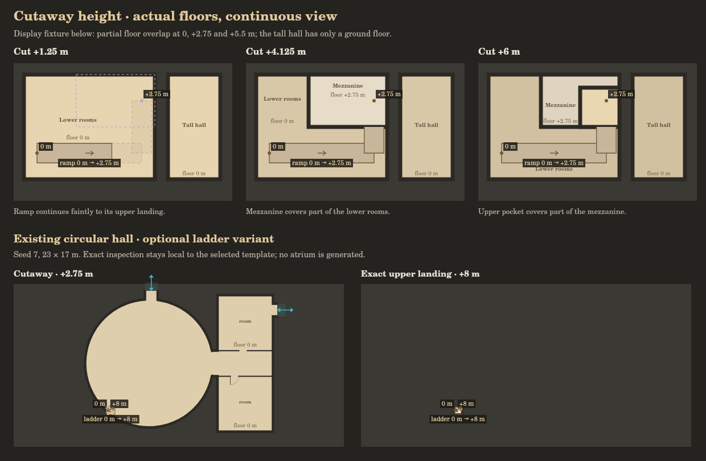
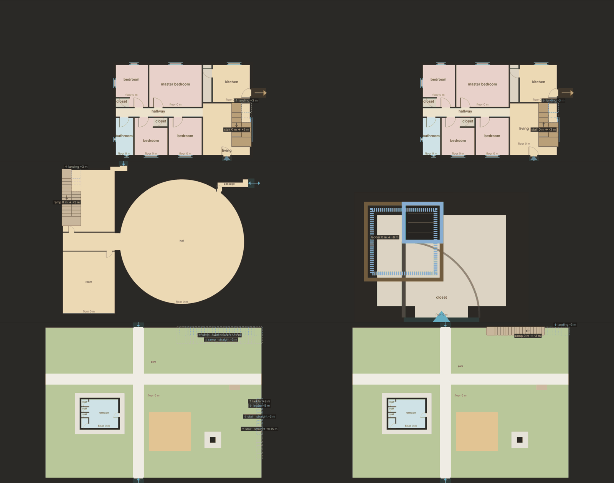
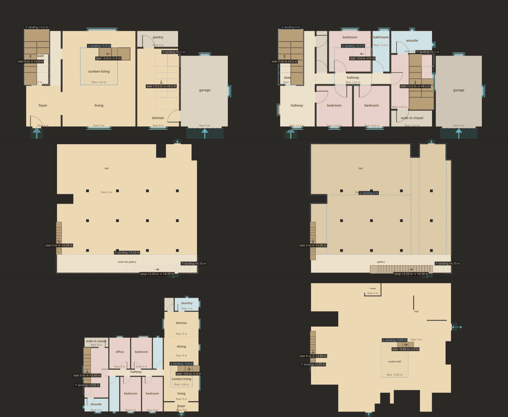
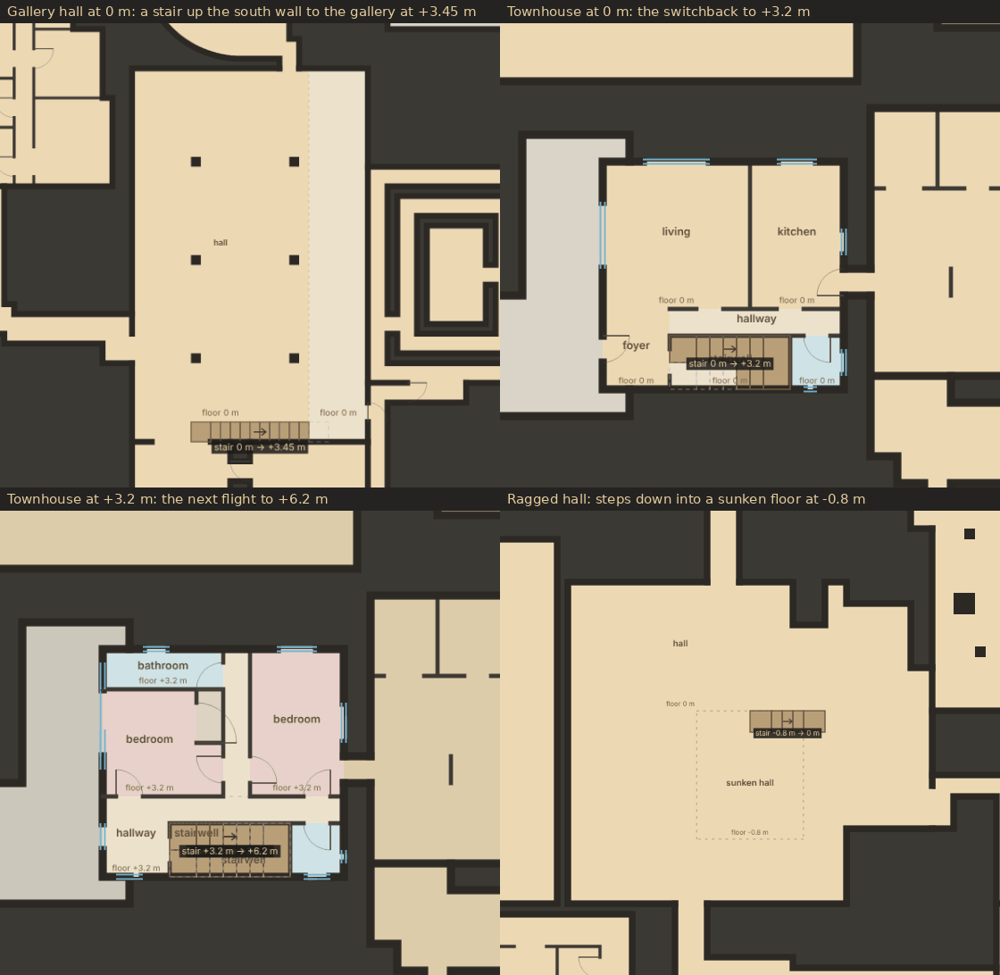
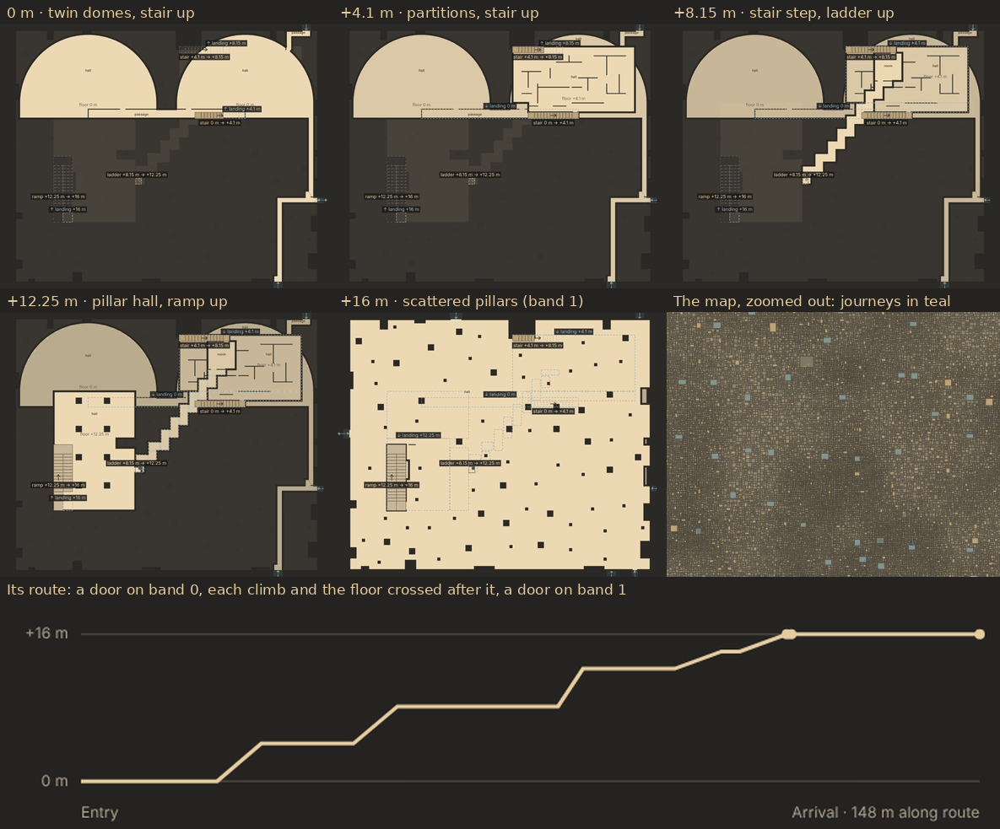

# Elevation implementation plan

Updated 2026-10-08 with milestone 4, world journeys. Milestone 3 (template
floors) was merged in [PR #19](https://github.com/Zetic/Backrooms-Prototype-Map/pull/19),
milestone 2 (connection zones) in [PR #18](https://github.com/Zetic/Backrooms-Prototype-Map/pull/18),
milestone 1 in [PR #16](https://github.com/Zetic/Backrooms-Prototype-Map/pull/16).
For the next agent's repository entry points and implementation context, read
[the handoff](../CONTEXT.md).

## Goal

Generate architectural elevation data that a later Unreal Engine generator can
build from. The prototype's top-down representation is an inspection tool; the
spatial data must stand on its own. Continue the existing flat geometry rules
rather than replacing them with unconstrained three-dimensional noise.

## Agreed design

- Multiple stable reference elevations support sprawling horizontal networks
  above and below ground zero. Ground zero's main routes should stay especially
  consistent. Band spacing is configurable policy, not a universal story height.
- A band is a horizontal reference and planning context, not a restriction on
  floor heights. Depressed rooms, pits, raised floors, mezzanines, and compact
  stacks can exist within a fill's home band.
- Most travel is horizontal. Local changes in elevation can be more frequent
  than major transitions between bands.
- The typical major transition is a fill or an element dedicated to vertical
  exploration. Rooms, ramps, landings, branches, stacked pockets, and overlooks
  make a journey. Direct stairwells, ladders, and shafts remain possible but
  should be a minority of major transitions.
- A fill may branch into neighboring bands or own territory across several
  bands. Its footprints can expand, narrow, shift, or disappear with height.
  Related territories are planned together and inform template selection.
- Every template, including a closet or lone room/zone, must support optional
  upward and downward connections. A compact ladder/hatch variant is the
  minimum fallback; larger templates can provide authored exploration variants.
  Supporting a direction does not imply selecting it on every instance, or
  guaranteeing both directions simultaneously in an arbitrary cramped layout.
- Vertical chains should combine templates and include horizontal exploration
  between successive connections. A ramp-heavy or ladder-heavy influence can
  guide a journey, while individual layouts and connection choices vary. An
  authored multi-floor house remains valid; its top can connect to a different
  template rather than repeating the house through the whole stack.
- Reserve what the geometry and its clearance actually need. Large empty
  reservation boxes and padding filled with repetitive identical rooms are not
  substitutes for an interesting template. Intentional tall rooms and protected
  voids remain valid, but their extent must follow the design.

## Three invariants

1. **Occupancy does not imply connectivity.** A tall hall can occupy
   an upper band's space without offering an entrance into that network.
2. **Reserve vertical space together.** Rooms, slabs, routes, pits, and voids
   belonging to one fill claim space before neighboring fills are generated.
   An upper template must not be placed inside a lower template's protected void.
3. **Every template has up/down potential.** Capability is a physical connection
   option with a host surface, hatch footprint, and landing allowance. Selection
   requires a valid destination and successful reservation, rather than adding
   an isolated label or cutting a hole into unknown geometry.

## Spatial model

Use sparse, stacked floor surfaces and a traversal graph. One height per XY
coordinate cannot represent rooms underneath mezzanines or compact stacks.
Bands organize the layout; actual floor and ceiling elevations are authoritative.
The existing 0.5 m horizontal kit grid does not prescribe staircase riser heights.

The additive export is `br.elevation/0.2` (0.1 before milestone 2), with metres
in a local site frame and Z increasing upward. It retains the building renderer's rooms, walls,
openings, levels, footprints, and room graph, and adds:

| Field | Purpose |
| --- | --- |
| `fillId` | Shared owner across all occupied elevations |
| `bands[]` | Stable reference IDs and elevations |
| `rooms[].floorZ, ceilingZ, band` | Explicit vertical bounds; `ceiling` remains clear height |
| `surfaces[]` | Flat floor footprints, room ownership, elevation, ceiling, slab thickness |
| `connectors[]` | Endpoint surfaces, XYZ landings and path, kind, shape, width, clearance, slope, rise, direction, `zone`, and `reservations[]` (one or more prisms). The template's own stairs carry `internal: true` and the `vertical` they were built from |
| `holes[]` | Explicit floor/ceiling cutouts required by a hatch or shaft |
| `volumes[]` | Occupied or reserved prisms, including traversal allowances and protected voids |
| `bandTerritories[]` | Sections of the shared reservation at reference elevations; these are occupancy, not walkable-floor masks |
| `capabilities` | Up/down support, ladder candidates, the zone IDs and types that fit, and the template's preference order; unselected by default |
| `connectionZones[]` | Available stair/ramp/ladder areas with endpoints and heights; see below |
| `navigation` | Surface graph with explicit connector references and direction |
| `route[]` | Authored XYZ main journey, for inspection and downstream use |

The source template (`br.building`) says which floors it has: `levels[]` (each
with an elevation; a gallery adds a level of its own), a room's `level`, and an
optional `floor` offset from it (a sunken floor is `floor: -0.6`). Its
`verticals[]` say which rooms a stair joins - storeys of a stairwell, a floor
and the sunken floor beside it, a hall and its gallery - with hints for the
elevation layer (`shape`, `types`, `walled`, `local`). The adapter turns each
into a real stair (see milestone 3); one that fits nowhere stays an abstract,
unresolved link with a warning, never a faked path.

`levels[]` in this export group actual floor elevations for local inspection.
They are neither world bands nor compulsory story numbers. A compact internal
floor can have a local floor entry while remaining part of its home band.
Use `navigation` for elevation reachability. The retained renderer-compatible
room graph has a single legacy `outside` node and must not be used to infer
connections between otherwise separate bands.

Ordinary openings must join floors at the same elevation. Different elevations
require an explicit connector with usable landings and a realizable path.
Floor heights and ceiling clearance are independent. Stacked rooms must leave
room for slabs; tall spaces and voids must be protected across affected bands.

Connection states are distinct: supported, selected, and connected. A capability
is supported; a request selects it; a matched destination and reserved route
make it connected. Occupancy sections and external band landings alone do not
create traversal edges into an ungenerated world network.

### Connection zones (implemented in milestone 2)

A connection zone describes the area available for a vertical connection.
It has no individual risers, treads, railings, meshes or props. A selected
variant still connects actual endpoints and reserves its occupied space and
clearance. An available zone and a selected physical connector stay distinct:
a zone is an entry in `connectionZones[]`; selecting one adds a connector, a
landing surface, cutouts, navigation and reservations.

| Zone field | Meaning |
| --- | --- |
| `id`, `owner` | `zone:<direction>:<type>:<surface>`; the template/fill that owns it |
| `direction`, `type`, `shape` | `up`/`down`; `ladder`, `stair` or `ramp`; `shaft`, `straight` or `switchback` |
| `state` | `available`, `selected` (requested) or `connected` (a connector built from it exists) |
| `surface`, `room`, `rects` | Host floor and the XY area the route, its entry and its landing occupy |
| `entry`, `exit`, `floorZ`, `targetZ`, `rise` | XYZ where the route starts and arrives, and the actual heights |
| `width`, `clearance`, `run`, `slope` | Route width, headroom, horizontal run, rise/run |
| `path`, `plan`, `destination` | Centre line, frame used to lay the route, landing footprint at the far end |

Types are catalogue rules (`TPL.CAT.CONNECTIONS`), not template code:

| Type | Width (min) | Slope (rise/run) | Headroom | Landings |
| --- | --- | --- | --- | --- |
| Ladder | 0.5 m | vertical | 1.8 m | hatch and 1 m landing |
| Stair | 1 m (0.9 m) | 0.45–0.84, laid at 0.7 (~35°) | 2 m | 1 m each end |
| Ramp | 1.5 m (1.2 m) | ≤ 0.25 (1 in 4), laid at 0.25 | 2 m | 1.5 m each end |

A stair or ramp is laid along a real wall of its host room (at least 75% of its
long side walled; an open boundary does not count) and is either straight or a
switchback (two lanes, a turn landing at half height). It must keep off
columns, existing floor holes, partitions, 1 m in front of every door, and
zones that are not marked for routes (`routes: true`; only the lawn is today:
a ramp can cross a lawn, not a park path or playground). A 1 m walker must
still reach every door and the route's entry around it. Its space must not
cross another surface in 3D.

Templates state a preference with `vertical: { prefer: [...] }` on a recipe or
filler. Houses prefer stairs; closets ladders; the park, circular hall, twin
domes, pillar hall and cross-pillar hall ramps first; sectors and radial
suites stairs. The default is stair → ramp → ladder. The ladder is always the
last resort. A preference is an order of attempts: a type whose geometry does
not fit is refused with its reason, and `auto` falls through to the next.

A zone's area is not itself walkable floor, a room, or a claim that its XY
footprint is blocked at every height. Zones do nothing until selected: no
cutout, no reservation, no navigation edge.

## Planning order for the eventual world

1. Establish stable horizontal networks and shared boundary landing elevations.
2. Select sparse major transition fills, plus local vertical opportunities.
3. Allocate jointly related territories and reservations across affected bands.
4. Select templates from the territory relationship and connection requirements.
5. Generate internal floors, passages, branches, connectors, and voids together.
6. Fit neighboring fills around reservations and match external landing contracts.
7. Validate traversability, volume conflicts, clearance, and boundary agreement.

Use deterministic shared decisions keyed by world seed, region, and band pair.
Generation order must not change a vertical reservation or connection. Control
major transition spacing by distance/area and regional topology rather than
independent doorway probabilities. Regions intended to be reachable need a
small planned connection backbone, with optional extra routes and loops.
Generate only needed bands/chunks and include band identity in cache keys.

## Current implementation milestones

This plan supersedes the initial atrium demonstration. The spatial contract,
optional ladder variants, band wrapper and exact portal validation remain;
the atrium generator, world placement policy and associated previews are removed.

### Implementation status

| System | Current state |
| --- | --- |
| Explicit room floors/ceilings, surfaces, graph and prism reservations | Implemented through the elevation adapter |
| Continuous cutaway and actual local floor selection | Implemented in milestone 1 |
| Connection zones (ladder, stair, ramp) on every template | Implemented in milestone 2; exported as `connectionZones[]` |
| Generated local vertical connections | Ladder, straight/switchback stair and ramp variants, chosen by template preference and fit; selected in the elevation lab |
| Slope-following reservations | Implemented: one prism per 0.5 m of flight; space under the high end stays free |
| Template floors | Milestone 3: two- and three-storey houses, sunken floors, galleries over an undercroft; the template's own stairs are real connectors |
| World connections between reference bands | Milestone 4: one journey per pair of neighbouring bands per 512 m region, a stack of different fillers joined by stairs, ramps and ladders; neighbouring bands are one network. Other templates' zones stay unselected in exports |

Old abstract stair annotations in source templates are not proof of a physical
vertical connection. The adapter reports differing-floor legacy links as
unresolved until actual connector geometry is authored.

### Milestone 1 — Cutaway presentation (implemented)

- Replace the global preset floor slices with a continuous cut height. Show
  the highest actual walkable floor at or below that height at each XY.
- Keep uncovered lower floors visible, shade them by distance below the cut,
  and label their actual floor elevation. Floor holes reveal lower surfaces.
- Selecting a map template opens only that instance's actual floor choices.
  Upper-floor ghosting is limited to that selected template. Its JSON download
  preserves the generated geometry, XY origin and absolute world heights.
- Keep exact local floor inspection in the lab and template workshop. The lab
  also has the cutaway control; selecting a local floor switches to exact view.
- Draw physical ramp/stair paths as full-width occupied strips, including bends,
  with solid portions below the cut and faint dashed continuation above it.
  Mark landing heights and the selected connection's destination footprint.
  Ladders use their reserved hatch/landing area. Clicking a connection reveals
  the other landing's floor.
- Ramps and ceilings do not create additional floor choices. A hall with an
  8 m ceiling still has one floor unless another surface is explicitly authored.
- Remove the atrium from generation and the lab. Until replacement journeys
  are implemented, the main world's reference bands are separate horizontal
  networks; switching bands is inspection, not player traversal.

This is a schematic projection of existing spatial data. It does not generate
new house floors, connection zones, chains or slope-following reservations.
The slider's 0.01 m increment is a UI convenience; numeric height entry accepts
arbitrary values, and the spatial model has no required 2 m vertical grid.

[Cutaway rendering preview](cutaway-preview.png). Its upper row is a display
fixture testing overlap and ramps, not a new world template. The lower row uses
an existing circular-hall filler with its optional ladder variant.



### Milestone 2 — Simple connection zones (implemented)

Every template and filler now reports connection zones in both directions: the
compact ladder it always had, plus straight or switchback stairs and ramps
wherever its rooms fit them. `BR.ELEV.connectionVariant(source, { direction,
type, rise })` selects one: `type: 'auto'` (the default) walks the template's
preference and falls back to the ladder; a named type is built or refused with
the reason. The selected variant gains:

- a landing surface at the actual destination height, walled on three sides
  with an opening on the arrival edge;
- the connector, with its centre-line path, slope, rise and zone;
- explicit cutouts wherever its space crosses the host floor slab (going down)
  or ceiling (going up), merged on the 0.5 m grid;
- a navigation edge and an authored route;
- slope-following reservations, claimed atomically with the template's volumes.

How the acceptance criteria are met and tested (`tests/connections.test.js`):

- Zones describe area and endpoint heights without step-level detail. Listing
  zones changes nothing in the blueprint.
- Types fit their width, slope range, landings and headroom, and the validator
  checks it: no vertical stair/ramp segments, slope inside the catalogue range,
  the whole path plus headroom sampled every 0.25 m inside some prism, no
  crossing of another room, required cutouts present. A closet asked for a
  stair is refused (with a reason) and `auto` gives it a ladder.
- Both endpoints are real surfaces, the far landing has an opening, and
  navigation follows the connector.
- Each reservation prism runs from just under its walking surface to its
  headroom. A room fits under the high end of a ramp, not under the low end;
  a downward route's prisms stop at the floor above where it tunnels under.
- Sloped paths add one landing floor and no intermediate floor entries.
  Explicit rises are exact (3.37 m and −4.2 m are tested). A rise too small to
  clear the ceiling is refused, never moved.
- The same template and request give the same variant, and the source
  blueprint is not changed. Placement in a band moves every prism and zone.

Default rises, used when no rise is requested: a stair or ramp climbs the host
room's clear height plus the 0.25 m slab (at least 3 m, rounded up to 5 cm) or
descends 2.45 m (a 2.2 m landing room and its slab, at least 3 m). The ladder
keeps its 8 m default, or clears a tall host's roof. These are standalone lab
defaults; the world planner must negotiate real endpoint heights.

Measured with auto selection over every template/filler at its middle size,
seeds 1–6, both directions (960 variants): about 54% stairs, 43% ladders and
3% ramps, with no failures. Ramps need long walls: the park and pillar hall
choose them; the circular hall gets one from about 30 × 24 m, where a wing
wall is long enough (at the lab's default 23 × 17 m its curved wall leaves only
a stair). Twin domes (curved
walls) and closets stay with ladders.

[Connection zones preview](connection-zones.png), from the lab at a 0 m cut:
ranch (seed 7) with a switchback stair up and down; circular hall at 30 × 24 m
with a ramp in its wing; a closet's ladder going down; the park's zones
(potential only) and its ramp going down.



Also fixed in this milestone: some house layouts fell back to a bare ladder,
or failed validation entirely, when a wing was reachable only through a second
door, or a yard lot was assembled in pieces. Reachability now starts at every
portal (each door is a way in), not only the main entrance.

### Milestone 3 — Template floors and authored vertical patterns (implemented)

Templates now have real floors at their own heights, joined by the same
stairs the connection zones use, and every template keeps its optional ladder
up and down.



*From the lab: a two-storey house at 0 m and at +3.2 m (the switchback in its
stairwell, a sunken living room, the exit up leaving from the master bedroom);
a pillar hall with a gallery at +3.35 m over an undercroft, its stair up the
west wall and a ramp on up from the gallery; a suburban house and a ragged
hall with sunken floors.*

**Storeys** (`storeys` on a house recipe; the House engine's `stack` plan).
The `two_storey` house has two floors; the `townhouse` has three, the top one
smaller. A stair core runs up one side: the foyer in front, a stairwell of
2 m by 4.5 m on the outer wall, a hallway beside it. The same stairwell and
hallway repeat on every floor; upstairs the hallway also spans the foyer.
Public rooms are below, bedrooms above, the master suite and a study on a
third floor. Storeys are 3.2 m then 3 m; a room under another floor keeps its
ceiling 0.3 m under it (its slab included), so the house tops out about
+8.7 m. A garage stays single-storey. They appear in the world at a low weight
(about 1 house in 10).

**Template stairs** (`linkFloors` in `connections.js`). Each pair of rooms a
source `vertical` joins gets a real stair from the lower floor to the higher
one, with no landing room of its own: it starts on the lower floor and arrives
on the higher one. Its rise is exactly the difference. It cuts the lower
ceiling and the higher floor only where its space passes through them, and
reserves its slope piece by piece. A 4.5 m stairwell holds a switchback per
storey; in a stack, the next flight runs over the cutout the last one made,
so a flight needs the room's footprint but not intact floor. The fitter keeps
every doorway clear of the flights and every floor walkable from its doors to
the landings. A short rise gets the run, in half metres, that keeps the
slope in range. The tower test shows an old abstract stair becoming two real
switchbacks in a 2 by 4.5 m core, and staying abstract (with a warning) in a
2 by 2.5 m core where nothing fits.

**Floor patterns** (`tpl/floors.js`, `floors` on a recipe or filler). A
pattern runs on the finished building, whatever its engine, and splits a room:

| Pattern | What it builds | Where |
| --- | --- | --- |
| Sunken floor | Part of a room drops 0.3-1.25 m, open all round its edge, a metre of floor left round it; same ceiling plane; straight steps down that fit inside it | Living rooms (suburban, two-storey houses), office, ragged, scattered and pillar halls; the park's pit (wrongness) becomes a real one |
| Gallery | A 2.5-4 m deep floor at +3.25-3.75 m along the longest straight stretch of a hall's real wall, with a rail on its open edge; the hall becomes double height; the undercroft below keeps the doors, columns and headroom; a straight stair climbs a side wall to it | Pillar, loop, ragged, office and scattered-pillar halls |

A pattern is kept only if the elevation layer can build its stair, every
other stair of the building is still built, and the building still validates
(without the elevation layer loaded, no pattern is applied, so a building
never depends on which modules a page loads). A gallery's rail keeps a `gaps`
entry where its stair arrives, for a later furnishing pass. Proving patterns
costs generation time: a hall or park that tries one builds in about 10-30 ms
instead of 5-10 ms. Halls whose walls jog round piers every few metres
(cross-pillar, gallery) have no straight stretch long enough and get none.
Templates built inside a composite (a neighborhood's houses, a park's
building) keep the floor they are built on: their spec turns patterns off.

**Exits up and down** leave from the top or bottom storey (floors within
1.5 m count as one storey: the main floor before a sunken floor beside it)
and keep away from where the template's own stair arrives, so a later
journey has to cross the floor. A gallery hall's way up leaves from the
gallery.

**Inspection.** The lab and the map cutaway show every floor; the workbench
has a tab per floor and draws the real stairs (solid where they start,
outlined where they arrive) with sunken floors labelled by their depth.

**Kept stairs** (added after milestone 4). A template's stairs are laid out
once, where it is generated, and kept on it (`stairs`, see
[the template contract](templates.md)): a floor pattern keeps the stairs it
proved, a house of several storeys has its laid out at the end of
generation. `prepare` takes them as they are instead of laying them out
again (the tests check they are identical), and the map cutaway draws them
from the template, so every elevated surface on the map shows how it is
reached: the stair up a hall's side wall to its gallery, a house's
switchbacks, the steps into a sunken floor, each at its width with its two
heights; click one to move the cut to where it arrives. Map painting still
never adapts a blueprint.

 A template whose geometry changed after it was
generated has its kept stairs ignored (they are fingerprinted) and laid out
again.

**World.** A band's site envelope now runs from -1.5 m (a sunken floor to
-1.25 m, plus its slab) to +14.5 m: the same 16 m, so bands still never
overlap.

Not yet: mezzanines open to more than one side, split-level houses (a whole
storey half a level up), pits without steps (a drop you cannot climb out of),
stairs that leave a room through a doorway, and composites with storeys of
their own.

### Milestone 4 — World journeys composed from templates (implemented)

The world's bands are joined again, by journeys made of templates
(`src/journeys.js`, placed by `src/band-world.js`).



*From the lab (mixed style, seed 3, 48 × 40 m): twin domes at 0 m, a stair up
to partitions at +4.1 m, a stair to the stair-step hall at +8.15 m, a ladder
to a pillar hall at +12.25 m, a ramp to scattered pillars at +16 m, the
upper band's floor. Each floor sits somewhere new in the territory. The
profile is the route from a door on band 0 to a door on band 1: every flat
stretch is a floor crossed. Bottom right, the map zoomed out: journeys in
teal.*

**A journey** climbs from one band's floor to the next band's, 16 m up,
inside a territory of 40-56 by 32-48 m. It is not one tall room:

| Stage | What it is |
| --- | --- |
| Bottom | A filler on the whole territory at the lower band's floor, its doors onto that band |
| Between (3 or 4) | A smaller filler (sides 11-22 m, 14-24 m for ramps, at least 9 m) at each step of about 4 m, built against the doorway of the landing the last climb arrived at |
| Top | A filler on the whole territory at the upper band's floor, less the opening the last climb comes up through, its doors onto that band |

Each climb (a *leg*) is a connection variant of the stage it leaves
(milestone 2): a stair, ramp or ladder, its rise set exactly so it lands on
the next stage's floor. Four rises are drawn from 3.4-4.6 m (five from
2.9-3.5 m for ramps) and scaled to sum to 16 m exactly: 3.2-5 m each (2.75-3.7 m
for ramps). The landing gets a doorway on a free side and the next
stage is built against it. Stage ceilings stay under the next stage's slab.
Fillers are built without floor patterns, and never repeat within a journey.

What a journey must do, and is checked for:

- **Cross every floor.** Where you arrive on a floor and where the next climb
  leaves are at least max(6 m, 0.35 × the floor's longer side) apart. On the
  bottom floor the first climb is at least max(6 m, 0.25 × the territory's
  longer side) from every door in; on the top floor (the upper band's own) the
  last landing is at least 6 m from every door out. The connection zones
  already lay a climb away from the doors.
- **No shafts.** No climb's footprint overlaps another's in plan, and no two
  start within 4 m. Of the sides a landing could open to, the next floor goes
  where it sits least over the floors before it, so a journey wanders across
  its territory rather than stacking floors in one footprint (consecutive
  floors overlap in plan by 20-35% of the smaller one, against 40-50% when
  the biggest side was taken).
- **Its style.** A journey leans one way, drawn from the seed: *mixed* (4 in
  9: each floor's own preference), *stairs* (2 in 9), *ramps* (1.5 in 9: five
  lower climbs on bigger floors, so ramps fit) or *ladders* (1.5 in 9). A
  leaning journey insists on its type for its first fillers before falling
  through to the others and the ladder. Over 20 journeys of each: stairs
  90% stairs; ramps 72% ramps; ladders 99% ladders; mixed 66% stairs, 31%
  ladders, 3% ramps.
- **Be one blueprint.** All stages are composed into one `br.elevation`
  blueprint (`kind: 'journey'`, absolute heights, ids prefixed `k<stage>.`),
  validated as a whole: every floor reachable from either band's doors and
  back, no volumes shared, every cutout explicit. Its `source` records the
  style, the rises and each stage's filler, height, rectangle and leg; its
  `route` runs from a door on the lower band through every climb to a door on
  the upper band. A room's `band` is the band its floor is in.

A journey takes 0.2-0.3 s to build on average (ladders fastest, mixed
slowest), from under 0.1 s to about 0.9 s; the first in a session takes over a
second while the code warms up. Where a landing opens onto the next floor,
each keeps its own wall on the line, with matching openings, as two
neighbouring sites do.

**In the world.** Every 512 × 512 m region (4 × 4 cells) holds one journey per
pair of neighbouring bands. `journeyPlan(lower, ri, rj)` places it from
(seed, region, band pair) alone: a cell, a size, a rectangle at least 8 m
inside the cell, clear of both bands' border openings. Pairs with an even
lower band use the region's west half, odd ones its east half, so a band's
journey down and its journey up never share ground. The plan also decides the
doors (`JOURNEY.plan`): three onto each band, on the territory's edge. Both
bands' cell plans reserve the rectangle as a lot of kind `reserved`, cut the
cell round it, and wire its doors into their networks; it becomes a site of
kind `transition` owned by the journey. Planning a cell never builds a
journey: the journey is built (and cached) when its site is, and builds
exactly the planned doors. Each band's slice binds only the doors at its own
floor. The journey's reservation runs from the lower band's envelope floor to
the upper band's ceiling limit, so nothing else is placed in it at any
height. A journey that cannot be built (no seed of four fits) leaves an
ordinary filler on its territory in each band, behind the same doors; the
bands stay apart there, and the export lists no journey.

Generation order and eviction cannot change any of it: the plan is a pure
function of its keys, the journey of its plan, and the tests compare
upper-first generation with tiny caches against a fresh world.

**Inspection.** The lab has a journey per style; the map paints journey
territories teal at plan zoom, its hover names a journey's bands, style and
floors, and *Journey ↓ / ↑* centre the view on the nearest one. The cutaway
shows each floor of a journey at its height.

Not yet: a template spanning bands on its own (a journey is the only
multi-band owner), branches from a journey into a band partway up,
coordinated footprints with the templates above and below a journey (its
neighbours are planned round its rectangle, not its floors), more than one
journey per region or district-dependent density and style, and journeys of
more than one band.

### Milestone 5 — Unreal consumer proof

Build a small consumer that reconstructs floors, walls, slabs, openings,
connection areas and protected voids. Agree width, headroom, slopes and traversal
capabilities with the game. The spatial export remains independent of this
prototype's schematic cutaway and the consumer's rendering/generation system.

## Current usage

Open [the elevation lab](../elevation.html) to see a template's floors and stairs (try
`two_storey`, `townhouse`, `pillar_hall`). It starts with the circular hall's
upward connection. Every template and filler can be selected, and the workbench
detail panel opens the same template, seed and size there. Choose a direction,
a type (auto, ladder, stair, ramp) and optionally an exact rise. “Potential only
· show zones” draws every available zone without connecting any. The reports
list the types that fit each direction, the template's preference, each link's
shape, run, slope and reserved prisms, and the zones table. A connected local
variant does not connect world bands; the lab's journeys (one per style, or
the style from the seed) are what the world places between them.

```js
const source = BR.TPL.generate({ archetype: 'ranch', seed: 7 });
const zones = BR.ELEV.prepare(source).connectionZones;           // opportunities only, nothing cut
const up = BR.ELEV.connectionVariant(source, { direction: 'up' }); // ranch prefers a stair
BR.ELEV.connectionVariant(source, { direction: 'down', type: 'ramp' }); // throws with the reasons each room refused it
BR.ELEV.validate(up); // { errors, warnings }
const ledger = new BR.ELEV.ReservationIndex();
ledger.reserve(up.fillId, up.volumes); // atomic claim, one prism per half metre of flight
BR.ELEV.drawCutaway(ctx, up, { cutZ: 0, scale: 20 });
```

A template's own floors come with it:

```js
const house = BR.TPL.generate({ archetype: 'two_storey', seed: 3 });
house.levels;                                  // [{ elevation: 0 }, { elevation: 3.2 }]
const p = BR.ELEV.prepare(house);              // its stairwell's switchback, built
p.connectors.filter((c) => c.internal);        // [{ kind: 'stair', shape: 'switchback', rise: 3.2, ... }]
const hall = BR.FILL.generate({ filler: 'pillar_hall', seed: 3, site: { w: 26, h: 24 } });
hall.meta.floors;                              // [{ pattern: 'gallery', at: 3.65, side: 'N', ... }]
```

Journeys, alone or as the world places them:

```js
const plan = BR.JOURNEY.plan({ seed: 3, w: 48, h: 40 });   // its doors onto each band, before building
const j = BR.JOURNEY.generate({ id: 'j', seed: 3, w: 48, h: 40, lower: 0, doors: plan, style: 'ramps' });
j.source;                         // { style, rises: [3.15, ...], stages: [{ filler, z, rect, leg }, ...] }
BR.JOURNEY.doorsAt(j, 16);        // the doors it built onto band 1
const world = new BR.BandWorld(7);
const p = world.journeyPlan(0, 0, 0);          // band 0 to 1 in region (0, 0): cell, rectangle, seed
world.journey(p);                              // its blueprint (cached), or null
world.nearestJourney('up', 0, 0);              // from the active band
```

`BR.ELEV.ladderVariant` remains for the compact fallback. Blueprints exported
as `br.elevation/0.1` (a single `reservation` per connector) are read and
upgraded by `prepare`.

[Current example export](elevation-example.json) (circular hall, seed 7, with
its upward stair) · [World ownership and export](elevation-world.md).

### Presentation in both directions

The milestone-1 review found the empty-lot ladder asymmetric: going down
showed detached corner strokes; going up painted the reservation like a gold
room; only upper destinations were outlined; labels overlapped. The cutaway
now draws:

- a ladder as an outlined footprint and hatch with rungs, never as a filled
  room: a dark opening when the hatch is in the floor you are looking at,
  dashed when it is overhead;
- stairs and ramps piece by piece at their width: solid where you would see
  them from the visible floor, blue dashed where a floor hides them below,
  violet dashed above the ceiling, with an uphill arrow;
- the far landing outlined in both directions (violet above, blue below) and
  tagged with its height;
- one label per connector, and staggered zone labels.

Occlusion still follows the actual floors; hidden geometry is never painted as
a solid surface.

## Open tuning decisions

- Reference-band spacing and variation between districts.
- Frequency of local elevation changes and major journeys.
- Minimum horizontal exploration between consecutive vertical departures
  (now max(6 m, 0.35 × the floor's longer side)), journey density (one per
  band pair per region) and the style weights.
- How often templates should have floors of their own, and which halls might
  take a gallery on a jogged wall.
- Whether more zones should allow routes (today only lawns), and preferences
  per district or journey influence rather than per template.
- Default rises for standalone variants once the world planner sets real ones.
