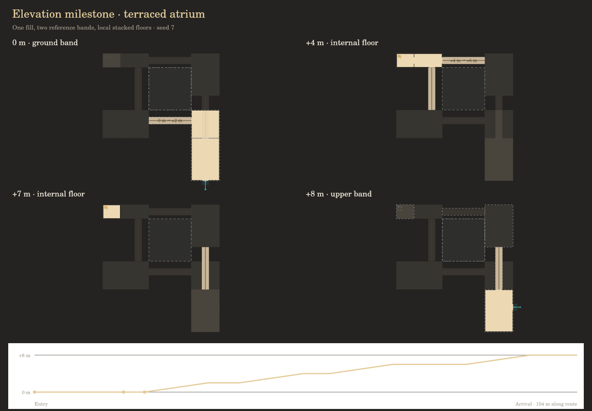

# Elevation implementation plan

## Goal

Generate architectural elevation data that a later Unreal Engine generator can
build from. The prototype's top-down representation is an inspection tool; the
spatial data must stand on its own. Continue the existing flat geometry rules
rather than replacing them with unconstrained three-dimensional noise.

## Agreed design

- Multiple stable reference elevations support sprawling horizontal networks
  above and below ground zero. Ground zero's main routes should stay especially
  consistent. Band spacing is configurable policy, not a universal story height.
- A band is a horizontal reference and planning context, not a restriction on
  floor heights. Depressed rooms, pits, raised floors, mezzanines, and compact
  stacks can exist within a fill's home band.
- Most travel is horizontal. Local changes in elevation can be more frequent
  than major transitions between bands.
- The typical major transition is a fill or an element dedicated to vertical
  exploration. Rooms, ramps, landings, branches, stacked pockets, and overlooks
  make a journey. Direct stairwells, ladders, and shafts remain possible but
  should be a minority of major transitions.
- A fill may branch into neighboring bands or own territory across several
  bands. Its footprints can expand, narrow, shift, or disappear with height.
  Related territories are planned together and inform template selection.
- Every template, including a closet or lone room/zone, must support optional
  upward and downward connections. A compact ladder/hatch variant is the
  minimum fallback; larger templates can provide authored exploration variants.
  Supporting a direction does not imply selecting it on every instance, or
  guaranteeing both directions simultaneously in an arbitrary cramped layout.

## Three invariants

1. **Occupancy does not imply connectivity.** A tall hall or an atrium can occupy
   an upper band's space without offering an entrance into that network.
2. **Reserve vertical space together.** Rooms, slabs, routes, pits, and voids
   belonging to one fill claim space before neighboring fills are generated.
   An upper template must not be placed inside a lower template's atrium.
3. **Every template has up/down potential.** Capability is a physical connection
   option with a host surface, hatch footprint, and landing allowance. Selection
   requires a valid destination and successful reservation, rather than adding
   an isolated label or cutting a hole into unknown geometry.

## Spatial model

Use sparse, stacked floor surfaces and a traversal graph. One height per XY
coordinate cannot represent rooms underneath mezzanines or compact stacks.
Bands organize the layout; actual floor and ceiling elevations are authoritative.
The existing 0.5 m horizontal kit grid does not prescribe staircase riser heights.

The initial additive export is `br.elevation/0.1`, with metres in a local site
frame and Z increasing upward. It retains the building renderer's rooms, walls,
openings, levels, footprints, and room graph, and adds:

| Field | Purpose |
| --- | --- |
| `fillId` | Shared owner across all occupied elevations |
| `bands[]` | Stable reference IDs and elevations |
| `rooms[].floorZ, ceilingZ, band` | Explicit vertical bounds; `ceiling` remains clear height |
| `surfaces[]` | Flat floor footprints, room ownership, elevation, ceiling, slab thickness |
| `connectors[]` | Endpoint surfaces, XYZ landings and path, type, width, clearance, direction, reserved space |
| `holes[]` | Explicit floor/ceiling cutouts required by a hatch or shaft |
| `volumes[]` | Occupied or reserved prisms, including traversal allowances and protected voids |
| `bandTerritories[]` | Sections of the shared reservation at reference elevations; these are occupancy, not walkable-floor masks |
| `capabilities` | Up/down support and physical candidate locations; unselected by default |
| `navigation` | Surface graph with explicit connector references and direction |
| `route[]` | Authored XYZ main journey, for inspection and downstream use |

`levels[]` in this export are display slices grouped by actual floor elevation.
They are neither world bands nor compulsory story numbers. A compact internal
floor can have a display slice while remaining part of its home band.
Use `navigation` for elevation reachability. The retained renderer-compatible
room graph has a single legacy `outside` node and must not be used to infer
connections between otherwise separate bands.

Ordinary openings must join floors at the same elevation. Different elevations
require an explicit connector with usable landings and a realizable path.
Floor heights and ceiling clearance are independent. Stacked rooms must leave
room for slabs; tall spaces and voids must be protected across affected bands.

Connection states are distinct: supported, selected, and connected. A capability
is supported; a request selects it; a matched destination and reserved route
make it connected. Occupancy sections and external band landings alone do not
create traversal edges into an ungenerated world network.

## Planning order for the eventual world

1. Establish stable horizontal networks and shared boundary landing elevations.
2. Select sparse major transition fills, plus local vertical opportunities.
3. Allocate jointly related territories and reservations across affected bands.
4. Select templates from the territory relationship and connection requirements.
5. Generate internal floors, passages, branches, connectors, and voids together.
6. Fit neighboring fills around reservations and match external landing contracts.
7. Validate traversability, volume conflicts, clearance, and boundary agreement.

Use deterministic shared decisions keyed by world seed, region, and band pair.
Generation order must not change a vertical reservation or connection. Control
major transition spacing by distance/area and regional topology rather than
independent doorway probabilities. Regions intended to be reachable need a
small planned connection backbone, with optional extra routes and loops.
Generate only needed bands/chunks and include band identity in cache keys.

## Milestones

### M1 — Spatial contract and a vertical exploration fill

Implement the model and validators in an isolated elevation lab reachable from
the map/workbench. Keep the existing world's generation unchanged.

- One deterministic fill connecting ground zero to an upper or lower reference
  band through several rooms and four ramp sections around a reserved atrium.
- Side branches and a compact stacked pocket demonstrate local floors that
  remain in the home band. In the upward example the pocket occupies the
  neighboring band's height without inventing a portal into that band. Clear
  height always extends upward, including in a downward journey.
- Shared ownership and differing occupancy sections at the two reference bands.
- Atomic cross-fill reservation checking, including otherwise empty voids.
- A common adapter provides every existing template and filler with up/down
  ladder/hatch candidates. A selected variant creates a real destination landing,
  cuts the relevant floor/ceiling, and reserves its shaft. Test the smallest closet.
- An inspection page provides floor selection, ghosted neighboring floors,
  connector paths, a main-route elevation profile, and complete JSON export.
- Verify both directions, determinism, connectivity from the ground entrance,
  stacked clearance, physical connector endpoints, collision rejection, and
  compatibility with the existing flat test suite.

This milestone does not populate upper/lower infinite world networks. Its
destination landings are demonstrator geometry; world-side portal matching is M2.
Legacy templates' abstract stair/elevator records are retained but flagged as
needing authored physical paths; the adapter must not pretend to resolve them.

### M2 — Deterministic band planning and matching

**Implemented.** The main map now uses band-aware world ownership, sparse planned
transition fills, shared reservations, and exact external portal matching.
Networks extend in both directions. Generation order, chunk boundaries, eviction
and regional topology are tested. Map controls inspect bands separately from
individual floor heights. See [M2 implementation and world export](elevation-world.md)
for the initial spacing/rarity policy, inspection controls and remaining scope.

### M3 — Authored template variants and elevation policy

Replace common compact fallback connections with authored vertical exploration
variants. Add sunken suites, pits with explicit hazard/traversal rules, mezzanines,
terraced halls, offset stacks, and multi-band fills. Tune ground-zero stability,
horizontal dominance, local variation, and major transition spacing. Potential
remains universal; activation remains selective.

### M4 — Unreal consumer proof

Build a small Unreal consumer that reconstructs floors, walls, slabs, openings,
connector geometry, and protected voids from the export. Agree character width,
headroom, slopes, step dimensions, ladder use, and navigation capabilities with
the game. Validate those against generated geometry. Keep the export independent
of whether the consumer uses Blueprint, C++, or PCG metadata.

Epic documents 3D transforms, bounds, and custom attributes on PCG points:
[PCG overview](https://dev.epicgames.com/documentation/en-us/unreal-engine/procedural-content-generation-overview).
This supports an adapter; it does not imply automatic import of this JSON format.

## Open tuning decisions

- Reference-band spacing and how much it can vary between districts.
- How recognizable major transitions should be versus long gradual journeys.
- Major transition spacing, local vertical variation frequency, and exceptions
  for deliberately inaccessible or hazardous spaces.
- Which templates receive dedicated exploration variants first.

The example's 8 m band separation, 2 m intermediate rises, and compact 3 m
stack are fixtures for exercising the contract, not final generation policy.
The compact adapter's default upper landing moves above the host ceiling if
8 m would place it inside a tall hall. An explicitly requested rise stays exact
and is rejected if it conflicts. The future band planner must negotiate such
constraints before choosing a template, rather than silently moving a world band.

## M1 usage and inspection

Open [the elevation lab](../elevation.html). The initial template is a vertical
exploration fill; choosing another template/filler exercises its compact fallback.
“Potential only” exports candidates without adding a connection. Upward/downward
variants include a generated destination landing, reserved shaft, and cutouts.
The connected flag applies to that internal demonstrator route, not a matched
connection into the infinite world's next band.

```js
const b = BR.ELEV.generate({ seed: 7, direction: 'up' });
const spatial = new BR.ELEV.ReservationIndex();
spatial.reserve(b.fillId, b.volumes); // atomic; returns conflicts if blocked
const closet = BR.TPL.generate({ archetype: 'closet', seed: 7 });
const vertical = BR.ELEV.ladderVariant(closet, { direction: 'down' });
BR.ELEV.validate(vertical);         // { errors, warnings }
```

[Example export](elevation-example.json) · [Rendered floor views](elevation-preview.png)


