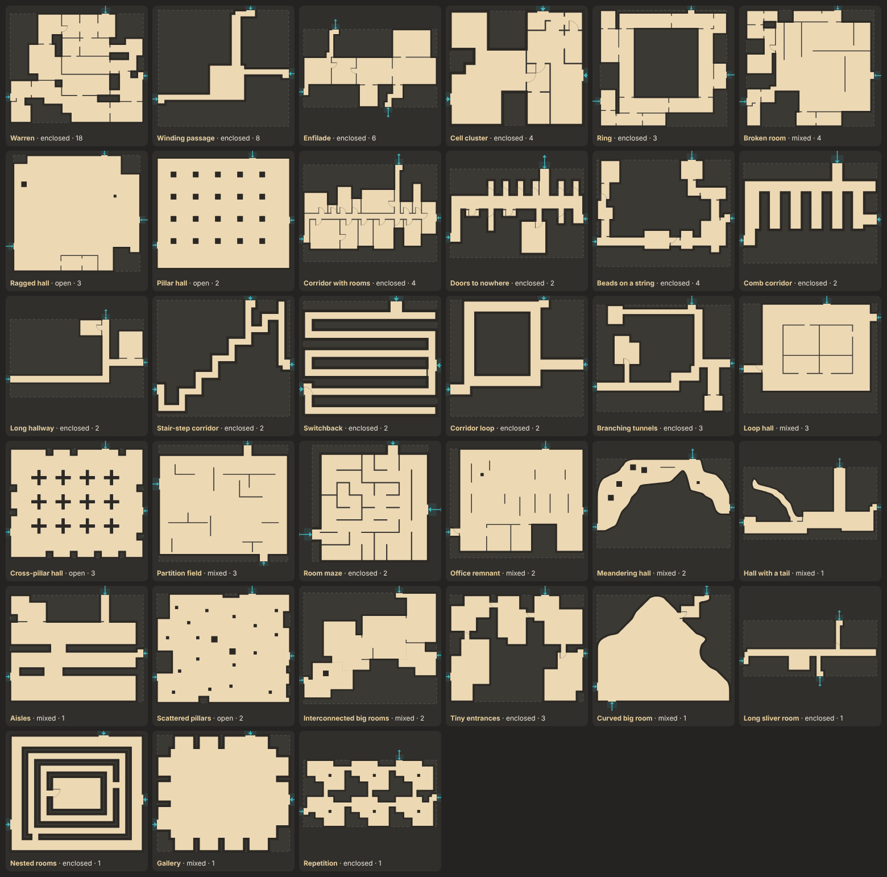
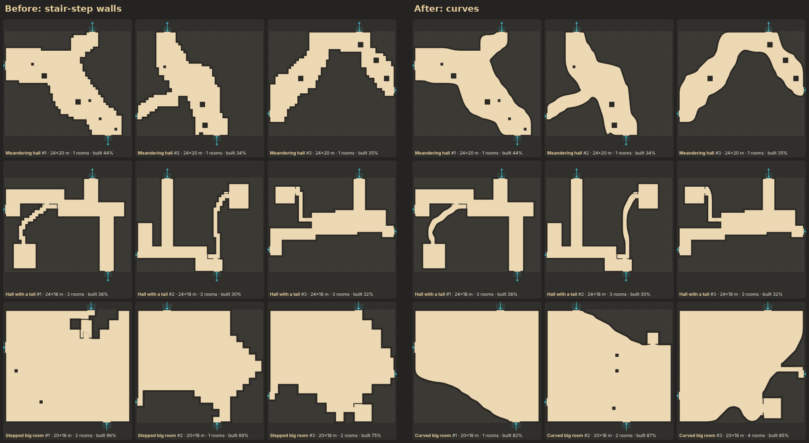

# Fillers: the plain Backrooms between POIs

In the template-first world every site is built by a template from its
connections. POIs (houses, restrooms, later malls and streets) claim their
places first: a house gets a lot with a front yard, a block-sized template a
lot of its own, and a smaller one sits inside a filler's site. Every other site gets
a **filler**, which also builds round any small POI inside it, taking its
doors as connections. Fillers are the bulk of the
map, so they are cheap (about 2–3 ms on a 10–24 m site), they cope with any
rectilinear site, and they honour every connection they are given.

They are Backrooms only and lean **enclosed**: clumps of irregular rooms,
long thin corridors with rooms hung on them, mazes and chains of rooms,
with a hall only now and then. Cells a filler leaves unbuilt are solid,
the mass between rooms that the reference maps are full of. Every filler
room draws in the one Backrooms carpet colour; zone colours are for POIs.



Try them in `workbench.html` (`fillers.html` now redirects there). They are
the *Fillers (Backrooms)* group in the library: one entry per filler, plus
*Pool pick*, where each seed picks a filler by weight. Page through seeds,
compare fillers with each other or with templates, change the site size and
shape, and set the connections by count or exactly (`S 4 1.5; E 10 2`:
side, metres along it, width). Pool pick with 48 seeds shows the mix in the
summary bar. *Check health* builds each filler on 12 standard sites and
shows how many came out clean.

The map (`index.html`) is built from fillers: every site that is not a POI's
lot gets one from the pool, weighted by the biome, and builds round any small
POI inside it. A house's lot is built by the `yard` filler
([docs/world.md](world.md)), in pieces: the front yard, and each door's
passage to the lot edge.

## The pool

33 fillers in four files, most drawn from the hand-drawn and pixel reference
maps. *Smallest* is the smallest square site (or, for a long one, the
narrowest 1 : 2 site) the filler takes; *map* is the share of the world's
filler sites it fits, since most of them are only 8–12 m across.

`pool.js`, the first fillers:

| filler | feel | weight | smallest | map | what it builds |
|---|---|---|---|---|---|
| `warren` | enclosed | 18 | 5.5 m | 100% | a clump of 3–10 m rooms, most made of 2–3 overlapping rectangles, with off-centre openings and solid pockets between them |
| `passage` | enclosed | 8 | any | 100% | a 1–2 m corridor that kinks between the connections, with alcoves and dead-end stubs |
| `enfilade` | enclosed | 6 | 8 m | 100% | a chain of rooms in a row through off-centre openings; sometimes it turns a corner |
| `cells` | enclosed | 4 | 6 m | 72% | a pocket of 2–4 m rooms and closets among ordinary rooms: a cluster in one end, closets off a short corridor, or small rooms round a middle one; sites up to 250 m² only |
| `ring` | enclosed | 3 | 11 m | 40% | rooms around a solid core (sometimes a closet), joined in a loop; warren or solid around it |
| `broken` | mixed | 4 | 7 m | 100% | a mid-size room cut up by stub walls and gapped partitions, with small rooms or solid around it |
| `ragged_hall` | open | 3 | 12 m | 31% | a big room with a notched outline, a few columns, sometimes a solid block to walk around |
| `pillar_hall` | open | 2 | 12 m | 31% | an open floor on a 3.5–6 m column grid |

`corridors.js`, the long thin passages and the rooms hung on them (all enclosed):

| filler | weight | smallest | map | what it builds |
|---|---|---|---|---|
| `corridor_rooms` | 4 | 7 × 14 m | 91% | one or two long 1–1.5 m corridors with small rooms and closets packed along both sides, like an empty office or hotel floor |
| `beads` | 4 | 5 × 10 m | 91% | a thin corridor wandering across the site with small 2–4 m rooms strung on it like beads |
| `tunnels` | 3 | 9 m | 92% | tunnels of mixed widths (1–2.5 m) branching like a tree from the connections, each branch ending in a small room |
| `doors_nowhere` | 2 | 6 × 12 m | 91% | a 1.5–2.5 m hall lined with doors, most onto 1 m closets or tiny dead ends, one or two onto a real room |
| `comb` | 2 | 8 m | 100% | a corridor with a row of short dead-end stubs or alcoves down one side |
| `long_hall` | 2 | 5 × 10 m | 91% | a narrow hall the length of the site with one or two turns and hardly a door |
| `stair_step` | 2 | 8 m | 100% | a corridor stepping diagonally across the site in 1–2 m jogs |
| `switchback` | 2 | 8 m | 100% | a corridor folding back and forth on itself, thin solid between the runs |
| `corridor_loop` | 2 | 7 m | 100% | a narrow corridor round a solid block, square or stepped, with spurs out to the connections |

`halls.js`, one big space that sets the tone of the site:

| filler | feel | weight | smallest | map | what it builds |
|---|---|---|---|---|---|
| `room_maze` | enclosed | 2 | 9 m | 70% | one square-ish room packed with short walls on a 1.5–2 m lattice, a maze inside a single room |
| `loop_hall` | mixed | 3 | 10 m | 52% | a wide 3–5 m hall in an L, U or ring round a block of 2–4 rooms that open off it, closing into a loop |
| `partitions` | mixed | 3 | 9 m | 70% | a large room full of free-standing straight, L and T wall pieces: the classic Level 0 look |
| `office` | mixed | 2 | 10 m | 52% | a big room with loose rows of cubicle stubs and a few small offices along one or two edges |
| `meander` | mixed | 2 | 10 m | 69% | a 3–6 m hall that bends across the site, its width wobbling like a cave, a few stray columns |
| `tail` | mixed | 1 | 9 × 18 m | 61% | a long room that ends in a thin winding 1 m corridor, sometimes to a small end room |
| `aisles` | mixed | 1 | 9 m | 70% | long parallel walls with gaps to cross between them, like shelving rows |
| `cross_pillars` | open | 3 | 9 m | 70% | a big hall with rows of plus-shaped pillars and a scalloped edge |
| `scattered_pillars` | open | 2 | 9 m | 70% | a big room with small pillars at random spacing and a notched edge |

`rooms.js`, where the shape of the rooms is the point:

| filler | feel | weight | smallest | map | what it builds |
|---|---|---|---|---|---|
| `tiny_doors` | enclosed | 3 | 9 m | 70% | 4–8 m rooms behind 0.5–1 m of solid, joined only by 1 m doors |
| `sliver` | enclosed | 1 | 5 × 10 m | 62% | one very long room 1.5–3 m wide with a nub on one side; long sites only |
| `nested` | enclosed | 1 | 9 m | 70% | ring corridors one inside the other round a small core, each entered on a different side |
| `repetition` | enclosed | 1 | 8.5 m | 84% | the same room, with the same partition or columns, copied 3–6 times in a row or grid |
| `big_rooms` | mixed | 2 | 10 m | 52% | 2–5 big rooms joined through wide openings or no wall at all into one sprawling space |
| `curved` | mixed | 1 | 8 m | 99% | a mostly rectangular room with one or two sides curving: a slope easing across, the solid bowing in, the room bowing out, or a wave |
| `gallery` | mixed | 1 | 8 m | 99% | a central room ringed by shallow bays between solid piers or wall stubs |

Not in the pool: `yard` (weight 0), a house's front yard (a strip across the
front of the house and a lane out to the lot edge) and the passages from its
other doors to the lot edge; the rest of the lot is solid (`src/tpl/lot.js`;
the yard comes as a `hint`).

The weights add up to 70 enclosed, 20 mixed and 10 open. `BR.FILL.pick`
chooses by weight among the fillers that fit the site (each has a `fits`
rule). A biome can pass its own `weights`; the world's biome tilts them
between deep warrens and open stretches. Across the map (8 seeds, about
15,000 sites) that comes to 71% of filler area enclosed, 19% mixed and 10%
open, with warren on about a fifth of the sites and every other filler
somewhere between 0.5% and 10%.

Shared pieces for layouts and furnishings are in `src/tpl/fillers/kit.js`:
`blob` (a room made of 2–3 overlapping rectangles, the room shape of the
hand-drawn maps), `row` (rooms side by side in a strip), `slice`, `stub`,
`alcove`, and for furnishing `stubWall`, `gappedWall`, `freeWall`, `column`,
`plus` (a plus-shaped pillar) and `wallPiece` (a free-standing straight, L
or T wall).

The old world-first fill's Backrooms zones and knobs were the starting
point for the first eight; the rest come from the reference maps in the
filler discussion of 2026-10-07.

## Input

```js
BR.FILL.generate({
  filler: 'warren',            // optional: picked from the pool when left out
  seed: 1234,                  // uint32
  site: { w: 24, h: 20 },      // metres; or { rects: [[x0, y0, x1, y1], ...] } for any rectilinear shape
  connections: [               // the openings the world's connection graph gives this site
    { id: 'n1', side: 'S', at: 4, width: 1.5, route: true },
    { id: 'n2', side: 'E', at: 10, width: 2, kind: 'door', route: false }
  ],
  weights: { warren: 30 },     // optional, only used when picking
  hint: { yard: [[2, 14, 28, 18], [10, 18, 16, 26]], adapters: [] }  // optional, metres: the yard filler's front yard and passages
})
```

* The site frame is the same as for templates: origin at the bounding-box
  corner, +x right, +y down, 0.5 m kit grid.
* A connection is an opening on the site outline. `side` is the direction
  you leave the site through it. It runs from `at` to `at + width` along that
  side (x for N and S, y for E and W). `line` picks which outline line when a
  side has several (an L or U site); by default it is the outermost one that
  fits. It needs 1 m of site behind it.
* `kind` is `opening` (the default) or `door`. `route` marks a connection on
  the main route rather than a side link; it is carried through as a tag.
* A connection that is off the outline, under 1 m wide or overlapping
  another is **refused** with `{ error }`, never moved.
* The result depends only on the spec. Connection order does not matter.

## Output: `br.filler/0.1`

The same shape as a template blueprint (`br.building/0.2`), so the same
renderer draws it:

| field | content |
|---|---|
| `schema, filler, name, feel, seed, grid` | identity |
| `site`, `connections` | the input, as used |
| `levels`, `footprint` | one level; the built cells |
| `rooms[]` | `{ id, type, name, zone, level, rects, area, ceiling, tags }`. Types: `room`, `hall`, `passage`, `cell`, `alcove`, `closet`. Every room is tagged `backrooms` plus what made it (`warren`, `enfilade`, `ring`, `bridge`, `landing`…) |
| `walls[]` | `exterior` (against solid or the site edge), `interior`, `open` (no wall), and `partition` (a free wall inside one room) |
| `openings[]` | `opening` (no leaf) or `door`, on their walls |
| `portals[]` | one per connection: `{ id, connection, opening, room, side, width, kind, tags: ['route' or 'side'] }` |
| `columns[]` | `{ id, room, rect }` |
| `curves[]` | only where a wall steps on a slant: `{ id, level, room, pts, line }`. `pts` is the curve drawn in place of the stair-step wall pieces in `line`, which runs from the curve's first point through the corners of the steps to its last. Both ends sit on the straight wall either side |
| `outline` | with `curves` only: `[{ level, rings }]`, the edge of the floor with the curves in place of the steps, for drawing the floor |
| `graph` | room graph, with `outside` for the portals |
| `meta` | `rooms, built` (share of the site built), `openFloor` (share of floor in rooms of 80 m² or more), `partitions, columns, curves, carved, loops, issues, ms` |

## Pipeline (`src/tpl/fillers/engine.js`)

There is no candidate search. A filler's `layout` paints rooms onto a raster
of the site once, and the shared pipeline makes the result sound:

1. **Land.** Each connection gets a landing, 1 m of floor behind the
   opening. If the layout left it solid, it joins the room next to it or
   becomes a passage.
2. **Clean.** Nothing narrower than 1 m. A room split in two becomes two
   rooms, and crumbs join a neighbour.
3. **Join.** If the floor is in pieces, the shortest 1 m passages through
   the solid join them.
4. **1 m.** A walker 1 m wide gets everywhere. Where a room steps
   diagonally so that it narrows under 1 m at a corner, a solid cell beside
   the step is filled. A room still pinched under 1 m becomes two rooms, and
   floor no walker can stand on turns solid. Two rooms that share no straight
   1 m of wall count as apart: the pinch between them is widened to 1 m, or a
   1 m passage joins them through the solid. A filler built in pieces (the
   yard) is settled the same way but never joined.
5. **Openings.** Portals go exactly where the connections are. Then the
   filler's open boundaries (no wall) and required links (a ring's loop, an
   enfilade's chain, a corridor's side rooms), a spanning tree of openings
   between the other rooms and a few extra loops. Two rooms that cannot
   share an opening lose the wall between them.
6. **Furnish.** The filler's partitions and columns are each kept only if
   the 1 m walker still reaches every floor cell. They keep clear of
   openings, and partitions never cross or double up.
7. **Curves.** The floor is a 0.5 m raster, so a wall on a slant comes
   out as a staircase. Where the edge between floor and solid steps three
   or more times the same way in a row (every other run at most 1.5 m, the
   rest at most 5 m), the steps are drawn as one smooth curve through their
   middles, easing in from the straight wall at each end. Points where rooms
   meet, the ends of openings and partitions, and the cells round columns
   never move. The raster stays the truth: rooms, walls and the walker are
   unchanged, and a curve keeps close to its stairs. Single jogs and the
   offset rectangles of blob rooms stay square. A filler can name **soft**
   rooms by tag (`soft: ['meander']`): there every run of 2 m or less
   between two corners is rounded too, so small bumps and jogs go as well.
   The meandering hall, the hall with a tail's corridor and the curved room
   are soft. They get curves on every site, the stair-step corridor on
   about two in five.

   
8. **Output.** Metres, site frame. The renderer draws the floor inside
   `outline` and the curves in place of the wall pieces they replace.

A new filler is a `layout` (and maybe a `furnish`), registered with
`BR.FILL.register({ id, name, feel, weight, blurb, fits, doors, loops, soft, layout, furnish })`.
The pipeline's helpers are in `BR.FILL.lib`: `bsp`, `voidSome`, `notch`,
`paintRooms`, `route`, `paintPath`; the shared layout pieces in `BR.FILL.kit`.
A layout can ask for links in `P.require` (pairs of rooms that must share
an opening) and for no wall at all in `P.open`; both, and `P.hall`, are
carried through when the engine renumbers its rooms. A furnish places
`walk.partition`, `walk.column` and `walk.pillar` (several rects as one
pillar, such as a plus), each kept only if the 1 m walker still gets
everywhere.

## Tests (`tests/fillers.test.js`)

These are checked from the output JSON alone, on every filler over many
seeds, site shapes (rect, L, U, notched, random) and 0–4 connections:

* on the kit grid, inside the site, no overlaps, nothing under 1 m wide;
* every connection is honoured exactly, on an exterior wall, facing the
  right way;
* every room is reachable in the graph, and a walker 1 m wide, starting
  behind the connections, reaches every floor cell, given walls, openings,
  partitions and columns (`tests/walk.js`); a gap under 1 m stops it;
* the result is the same whatever was built before, and in any connection
  order;
* bad connections are refused, and tiny or odd sites still build;
* the pool picks only fillers that fit and leans enclosed;
* every curve starts and ends on its room's straight exterior walls,
  replaces only that room's exterior wall pieces, never runs over an
  opening, and keeps within 1 m of the steps it replaces;
* the average time on 10–24 m sites stays under 5 ms (it is about 2.5 ms).

## Next

* Zones or districts: neighbouring sites share a filler family or a carpet
  colour, as the reference maps group similar spaces into named areas.
* Ceiling lights drawn in rows along corridors and halls.
* House and Rooms take their entrances from connections in the same way.
  Today they choose their own doors, and the world or the filler round them
  adapts (docs/world.md).
* Wrongness for fillers (false doors, dead-end loops, a ceiling at the
  wrong height), and later flooding and props.
