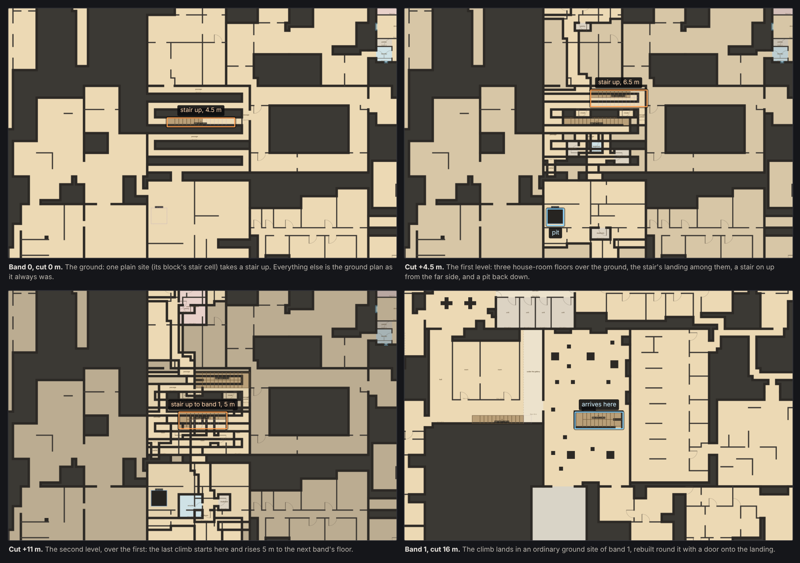

# Vertical growth: pillars, branches and biomes

The growth design, as written by the project owner (2026-10-08), with the
state of each build step. Implementation detail lives in
[elevation.md](elevation.md) and [elevation-world.md](elevation-world.md).

## Build order and status

| Step | What | State |
| --- | --- | --- |
| 1 | Layered ownership: claims with height ranges, ground ceilings capped where something sits above; one hand-placed branch over a ground site proves the stacking | Done: milestone 5, PR #24 |
| 2 | One house pillar and its branch: a multi-storey house's stairwell carries on up; one houseroom branch grows at a pillar floor, drawn from a first tagged pool | Done: PR #25 |
| 3 | Recursive growth: pillars from branches, a per-region budget and plan, steering toward the next band; today's journey plot becomes the fallback | Done: this step (see below). The journey plot is removed from the world rather than kept as a fallback (owner's call) |
| 4 | Houseroom variety: new houseroom fillers, so a district never repeats itself | |
| 5 | Emergent connections: pits that drill down to the next exposed volume first, then holes rolled on shared walls; drilled walls after | Pits between a branch and the ground exist (milestone 5) |
| 6 | Linking growths: branches of the same biome that come close join up, and districts cross region borders at planned points | |

**Step 2 as built.** A house whose archetype seeds growth (`grows: { biome:
'houseroom' }` on `two_storey` and `townhouse`) carries its stairwell one
flight on up to a landing at its lot edge: its pillar, at +6.5 m over a
two-storey house and +9.5 m over a townhouse. A share (75%) of such houses do,
by the seed, at most one per cell. From the landing a branch grows over 1-4
plain ground sites joined edge to edge (1,200 m² at most). Each branch site is
a houseroom filler with houseroom rooms standing in it, 2-3 beside the pillar,
1-2 one site out, 0-1 further. The pool is the house rooms the catalogue
already makes into templates (bedroom, kitchen, bathroom, dining, living,
family room, master bedroom, ensuite, walk-in closet, pantry, laundry,
mudroom, foyer, closet) and seven fillers that read as a house's insides
(corridor with rooms, enfilade, cell cluster, doors to nowhere, beads, ring,
loop hall). No room repeats within a site. Biome tags are data
(`biomes: [...]` on catalogue rooms, templates and fillers), read by
`src/biomes.js`.

**Step 3 as built** (`src/growth.js`). The owner's answers: not every
region must guarantee a way up, but guaranteed ways up should be spread over
the world; districts may cross into other regions without limit; the old
journey plots go.

- *Origins.* A cell is an origin when a house in it seeds growth, or when it is
  its block's stair cell: every block of 4 × 4 cells has one cell, by the seed,
  that grows from a plain ground site whose own filler takes a stair (or ramp,
  or ladder) up to +4.5-6.5 m. At most one growth per cell.
- *No region bounds.* A growth uses its own cell and the cells round it that
  have no origin of their own and whose top-priority origin neighbour it is.
  Ownership is settled cell by cell from the cell plans alone, so a district
  crosses cell (and old region) borders wherever it grows to, and two growths
  never claim the same ground.
- *Levels.* From the pillar's floor, legs of 3-6.5 m on the half metre, the top
  floor at +9.5 to +11.75 m: a storey under the band's ceiling and one leg
  under the next band's floor. A townhouse (+9.5 m) climbs straight to the next
  band; a two-storey house (+6.5 m) or a stair pillar has one more level. Each
  level grows over 1-4 sites, over plain ground and the level below.
- *Pillars from branches.* A leg leaves from a floor of the level, the furthest
  from where the level was entered: that floor's own filler takes a stair or
  ramp (a ladder only where neither fits) with the exact rise. Its landing opens
  onto the next level's first floor, which stands over the rest of that site.
  No climb stands over another.
- *Reaching a band.* The last leg climbs to the next band's floor inside one of
  that band's landing sites (40% of its plain sites, by the seed, which no
  growth of their own band uses). The landing site is rebuilt round the climb
  with its own doors and one onto the landing; nothing else marks it.
- *Steering, spread out.* Every block's stair cell and half the house growths
  are steered: they plan every level and the arrival, and their top level
  grows toward landing sites. The rest climb each level by chance. Over the
  test window, about three steered growths in four arrive and about nine blocks in
  ten have a way up; a block whose growths all fail simply has none, and its
  neighbours carry it.
- *Unchanged.* The ground plan (with the journey plots gone, every cell is
  planned as before milestone 4), pits from the first level into the ground,
  biomes and their pools, the claims mechanics.

*Seed 7, the stair cell of block (−1, −1), the same 49 × 32 m at four
heights. At 0 m one plain ground site takes a stair up 4.5 m. At +4.5 m the
first level of house-room floors stands over the ground, with a stair 6.5 m on
up from its far side and a pit back down. At +11 m the second level stands
over the first and the last climb rises 5 m. On band 1 it lands in an
ordinary ground site rebuilt round it.*

*Checked after review:* planning never writes into a cell plan or a planned
growth (the suite freezes both and builds and exports over them), a level that
cannot be built after its leg was laid undoes that leg cleanly, and a climb's
landing site comes out the same whichever band is built first.

---

## Summary

The climb between bands stops being one built plot and becomes something the
world grows. Short pillars rise from some POIs. Branches of templates spread
sideways off them at the pillar's heights, and new pillars rise from the
branches. A way from one band to the next exists wherever that growth happens
to chain all the way up.

- Today's journey plot (one stack of floors that climbs exactly 16 m) is no
  longer the unit. Growth is planned per region and stays deterministic.
- Branches take the biome of the POI they grew from: a house starts
  "houseroom". Pits drill down to the next open space below, and holes are
  rolled where walls meet; neither is relied on.
- The bands stay as the average elevation of the world and as planning
  references. The ground floor and its main routes stay stable.

## Terms

| Term | Meaning |
| --- | --- |
| Band | A reference plane every 16 m. It holds the ground floor of the world at that height and its main routes. A planning reference, not a compulsory storey. |
| Pillar (semi-spine) | A short vertical structure that climbs a few metres, with floors at its own heights. It starts from a POI or from a branch, and it doesn't have to reach a band. |
| Branch | Templates grown sideways off a pillar floor, at that floor's height. It can dead-end, drop back down, or carry new pillars. |
| Biome | The family of templates a growth draws from, set by the POI it started at (house → houseroom). |
| Spine | No longer built as a thing of its own. "Full spine" just means a chain of pillars and branches that reaches the next band. |
| Journey | Any route a player takes from one band to the next, through whatever was generated. |
| Emergent connection | A hole rolled on a shared wall, or a pit drilled down to the next open space below. Never planned and never relied on. |

## Where we were (before step 1)

The data is already mostly 3D. What is flat is the world planner.

- One owner per column. Each band is its own 2D map of cells tiled into sites,
  and each site owns its whole column for that band (about −1.25 to +14.5 m).
  It owns that column even when it only builds a 3 m filler. Nothing can sit
  above or below anything else.
- Connections sit at the band floor. Every opening the cell plan makes between
  two sites is at the band's own floor height.
- One journey plot per band pair per region. It is a single rectangle reserved
  in both bands, built as one stack of 4–5 fillers climbing exactly 16 m. It is
  sealed off from its neighbours except for its doors at the top and the
  bottom.

What we can build on:

- Rooms carry explicit floor and ceiling heights, and a template can be
  prepared at any base height, its kept stairs included.
- Doors between blueprints match on exact XYZ, width, side and headroom.
- Stairs, ramps and ladders can be fitted with an exact rise, or refused with a
  reason.
- A 3D reservation ledger already holds journey volumes.
- Navigation has one-way edges, and its graph is what the band-to-band walk
  test uses.
- Seams already find every shared wall between two blueprints and roll windows
  and doors on it, the same whatever was built first.

## The growth model

There is one building block, the pillar. Growth alternates between climbing on
pillars and spreading on branches until it runs out of budget or height.

1. **Seeds.** Some POIs in a region are chosen to start a pillar: a share of
   them, not all. A multi-storey house's own stairwell can simply keep going
   past its top storey.
2. **Pillar.** It climbs 3–8 m in one or more flights, with a floor at each
   landing. Each flight is a real stair, ramp or ladder with an exact rise.
3. **Branch.** From a pillar floor, a door leads sideways into templates grown
   at that height, over the low ground sites next to it. A branch spans one to
   a few sites. Then it ends, drops back down, or carries a new pillar.
4. **Repeat.** New pillars rise from branches, usually a few sites away from
   the last one, so climbing means crossing ground at each height.
5. **Reaching a band.** A chain that gets within reach of the next band ends in
   an ordinary site there, with no POI needed. Nothing marks it as special.

Rules carried over from journeys: consecutive climbs never stack over one
another (no shafts), templates don't repeat along one chain, and every rise is
exact. Growth also goes downward toward the band below, the same way.

From the house, a pillar climbs to a houseroom branch at +6.5 m. A second
pillar climbs from that branch to +11 m, and a third reaches band 1. A second
house's pillar meets the upper branch only by chance, through a hole.

## Biomes

Growth from a POI draws its templates from that POI's biome, so a house grows a
district of house rooms, not generic backrooms.

- **Anchors.** An archetype gets a flag saying it can seed growth and which
  biome it starts (house → houseroom). Parks, offices and others can follow
  later with their own biomes.
- **Eligibility.** Templates and fillers carry biome tags, and a branch draws
  only from its biome's pool. A template can belong to several biomes.
- **A head start.** The catalogue already makes every house room (bedroom,
  bath, hall, closet, kitchen) a template on its own. Tagging those gives a
  first houseroom pool.
- New houseroom fillers add the variety: corridors of doors, landings, attic
  crawlspaces, stairwells that turn the wrong way, rooms of odd sizes.
- **Size.** A biome district stays small: a few sites around its pillars, dense
  near a pillar and thinning with distance.
- **No repetition.** The atrium was rejected for repeating same-size rooms. The
  pool has to be large enough that a district never reads as a grid of copies.

## Emergent connections

Emergent connections join spaces that were never planned to meet. There are two
kinds: soft ones, rolled where walls happen to touch, and drilled ones, forced
through whatever lies between. Pits are the first drilled kind.

**Soft: rolled on shared walls.** This is the seam idea from today. Where two
spaces share a wall at similar heights (an elevated filler room next to a
houseroom), a roll may cut a door or a hole. The roll belongs to the seam, so
it comes out the same whatever was built first.

**Drilled: pits first.** Templates never open their own ceilings, so nothing
ever connects upward on its own. A pit does it from above: it drills straight
down until it reaches the next exposed volume, a real room with a floor.

1. Where. A pit goes in a floor with something below it: a branch over ground
   sites, a raised floor over an undercroft, or a ground floor over the band
   below.
2. The drill. It goes straight down from the pit's footprint, through its own
   slab, any empty or solid gap, and the ceiling of the room it reaches. Every
   layer it passes gets a hole, and the shaft is reserved in 3D so nothing else
   is built into it.
3. Landing. The footprint must land on open floor below: not a wall, column,
   stair flight or protected void. If it doesn't, the pit shifts or shrinks
   within its own floor. If nothing fits, it stays a blind pit with no drop.
4. The edge. The drop is a one-way navigation edge down, with its height
   recorded. The game decides what a fall of that height does. A pit never gets
   a ladder or rope, however deep: it exists to drop the player into what lies
   below.
5. Planned, not built. The drill is worked out from the claims in the region's
   plan, not from whatever happens to be built, so it lands in the same place in
   any streaming order.
6. Between bands. A pit in band 0's ground floor can drill into band −1's
   tallest rooms. That makes the first unplanned way down between bands.

**Later: drilled walls.** The same machinery, sideways. Pick a wall, drill
through it, and lay a short path through empty space to the next volume, with
holes at both ends and the path reserved. Pits come first because their path is
a straight vertical line, with no route-finding.

**Never load-bearing.** Every reachability guarantee holds with all emergent
connections removed. A drop may land in a dead end, but every room below
already has its own way out.

## Planning and guarantees

Growth is planned for a whole region before any of it is built, as journeys are
now, so the map can stream in any order and still come out the same.

- **Pure function.** A region's growth plan depends only on the seed, the
  region and that region's ground plan. Cache eviction and visiting order
  change nothing.
- **Region bounds.** Growth stays inside its region, or crosses into a
  neighbour only at points both regions plan the same way. This is the open
  question on how far a district may spread.
- **Budget.** Each region gets a budget of pillars and branch sites, and a
  band's height limit caps each growth. Seeds are a share of eligible POIs, so
  most POIs have nothing above them.
- **Ground routes stay clear.** Growth never sits over a main route at ground
  level, and the sites under a branch keep their ground floor with their
  ceiling capped.
- **Steering, not a fixed plot.** After growing, the planner checks whether any
  chain reaches the next band. If none does, it extends the most promising
  branch upward until one does. The player can't tell a steered chain from any
  other.
- **Fallback.** If steering fails (rare, as journey stand-ins are today), the
  region is left without a way up there, and neighbouring regions carry it.

## Layered ownership

A column of the world has to hold any number of owners stacked at different
heights. This is the change everything else rests on.

- **Claims, not columns.** Each owner holds a claim: an XY area with a bottom
  and a top height. A ground site's claim runs from its floor to a capped
  ceiling, and a branch site above it claims from its slab upward. The 3D
  reservation ledger already stores volumes like these.
- **Slabs and headroom.** Between two stacked claims sits a slab of the
  existing thickness. A claim below keeps at least the headroom its rooms need,
  so the ground plan decides how low a branch may sit.
- **One planner per layer.** The ground plan stays the 2D cell plan it is
  today. Growth is a second planning pass that only takes space above it.
- **Export.** A layout gains its claim's height range. Portals already carry
  XYZ, so connections need no new fields.

## Checks

The tests stop asking whether one plot climbs exactly 16 m. They ask whether
players can find their way up, and whether everything stacked is sound.

- **Reachability.** In each region, the navigation graph reaches the next band
  from the band below, with every emergent connection removed. Where the plan
  has more than one chain, there is more than one route.
- **Ownership.** No two claims overlap in 3D, and every claim keeps its slab
  and headroom.
- **Ground stability.** Main routes at ground level are unchanged by growth.
  The ground plan is identical with and without growth.
- **Determinism.** The plan is the same in any order and with tiny caches, as
  today.
- **Shape.** No shafts. Pillars at least the set distance apart along a chain.
  Biome pools respected. A share of POIs seeded, not all.
- **Emergent connections.** Holes and drops meet the existing seam rules:
  inside the shared wall, clear of other openings, floor on both sides (or a
  landing below a drop).

The naming change (journey becomes the player's route) lands with step 3, when
the old plot stops being the only way up.

## Open questions

- [x] Should every region guarantee a way up to the next band, or only most
  regions, with neighbours covering the rest? *Not every region: ways up are
  spread out, one steered growth tried per block of 4 × 4 cells (step 3).*
- [ ] Which POIs seed growth besides houses, and with what biomes (park,
  office)?
- [ ] What share of eligible POIs seed a pillar? This decides how rare a
  houseroom district feels. (Step 2 uses 75% of the houses that can.)
- [x] May a district cross region borders, or does each region keep its own
  growth? *Yes, without limit; ownership is settled cell by cell (step 3).*
- [ ] Is a drop allowed to land somewhere with no quick way back up?
- [x] Does today's journey plot survive as a rare style of its own once growth
  works? *Removed from the world for now (step 3); the generator stays in the
  elevation lab.*
