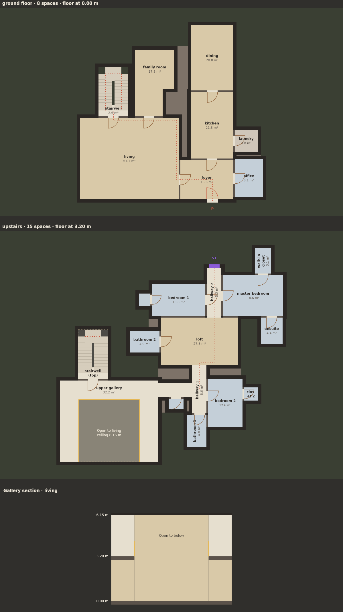

# Room-first heights, openings and upper galleries

The separate `space.html` experiment now treats height as placement geometry.
An upper gallery is actual floor around protected airspace above a lower public
room. It participates in the passage; it is not painted onto a finished layout.
This extends only the `src/space` test bed, without changing world/template
exports or adopting the `br.elevation` schema.



## Try it

Select **Gallery house (two floors)** or **Mansion experiment (three floors)**.
Both selections enable heights, shaped placement and an L gallery. Choose
**Interior balcony**, **L gallery** or **U gallery**, overlooking **Living
space** or **Foyer**. The gallery is on the first upper floor; a mansion still
has its third floor and middle/top secondary connections. **Off** keeps physical
heights and stairs without an open gallery. A single-floor recipe has no upper
gallery even when a profile is selected.

**Floor rise** ranges from 2.8 to 4.2 m, snapped to the placement solver's 5 cm
step. Floor slabs are 0.25 m. Ordinary clear ceiling height is rise minus slab.
Floor plans stack vertically, retain common building coordinates, and show
floor elevations, protected openings, guards and stair paths. A section below
the plans shows the gallery slab, covered space and double-height opening.
The room table lists each room's maximum clear height; `clearVolumes` describes
its local ceiling patches. JSON export includes the physical geometry.

**Height experiment** off retains flat placement and its archived schema.
**Compare shapes** shows a flat comparison and the selected height experiment
when heights are enabled. Gallery generation adds a circulation room, may
move intervening ground passage rooms to connected side groups, and may enlarge
the lower public room to leave a usable void. The original non-circulation
room program and required direct relationships are retained; seed geometry is
not promised to match the flat comparison. Enlarged targets retain
`sourceTarget` as well as the effective `target`.

## Placement rules

- A lower gallery room has a rectangular core large enough for the walkway and
  a void at least 2.8 m in each dimension. The chosen public room may expand;
  other halls and living rooms still use the existing shape profiles.
- The lower room reserves two floors of air before upstairs placement. Gallery
  floor occupies only edge strips; the covered lower ceiling ends at the slab
  underside. Its open core retains the tall ceiling. Upstairs rooms grow around
  that core, with a wall allowance, rather than across it.
- Candidate room volumes and floor slabs are checked against rooms on other
  levels. A requested tall room is retained and upper placement grows around it.
  Same-level floor, wall gap and complete-program checks remain in force.
- The first gallery stair is a compact switchback with 1.2 m lanes. Other stairs
  are 1.5 m wide straight flights sized to the requested rise. Both have 1 m
  entry/exit landings, finite slopes and 2 m reserved headroom following the
  physical path. The upper shaft is cut from its slab except for the landing.
- Kitchen remains directly connected to dining, and pantry to kitchen when
  relationships are enabled. Mansion relationships are mandatory. The main
  passage crosses the gallery and continues upstairs; side groups cannot bypass
  passage steps. Original ground route rooms moved aside remain connected.
- Search evaluates 60 attempts, then continues only if none succeeded, up to
  240 attempts. Failed complete-program or site constraints return an explicit
  error; a gallery is never silently replaced with an ordinary upper room.

## API and export (`br.space/0.4`)

Load core, recipes, space, route, shapes, house, **heights**, then render.
The API is opt-in except that `galleryhouse` enables heights and an L gallery
by default. Browser defaults enable height mode; explicit `heights:false`
restores the previous generator behavior.

```js
const h = BR.SPACE.generate({
  recipe: 'mansion', seed: 1, secondaryConnections: 3,
  heights: true, storeyHeight: 3.2,
  gallery: 'U', galleryRoom: 'living',
  shapes: {hall: 'T', living: 'alcove'}
});
BR.SPACE.verify(h);

// Tall rooms without a gallery, constrained during upper-floor placement.
BR.SPACE.generate({recipe:'passage', seed:2,
  heights:{storeyHeight:3.2, roomHeights:{living:7}}, gallery:'off'});

// Flat comparison. Gallery-house becomes its ordinary two-floor room program.
BR.SPACE.generate({recipe:'galleryhouse', seed:1, heights:false});
```

`roomHeights` specifies type-wide clear heights between 2.2 and 12 m. Stair and
upper-gallery heights derive from the floor rise, and cannot be overridden.
Garage height must fit its 2.4 m vehicle opening. Gallery core heights may
exceed two floors; under-walkway patches retain the slab clearance.

All exported geometry is in metres:

| Field | Meaning |
| --- | --- |
| `spaces[].floorZ/ceilingZ/height` | Floor and maximum ceiling elevations, and maximum clear height |
| `spaces[].clearVolumes` | Clear room prisms `{rect,z0,z1}`, including different ceilings under/through a gallery |
| `spaces[].floorRects` | Actual flat floor; stairs have landing floor only |
| `spaces[].planRects` | Stair shaft planning envelope; not a flat floor |
| `surfaces[]` | Actual floor rectangles, room, floor elevation and slab thickness |
| `holes[]` | Gallery/stair slab cutouts with level and vertical slab interval |
| `voids[]` | Protected gallery airspace with lower room, gallery and height range |
| `guards[]` | Interior gallery edge lines, elevation and 1.1 m height |
| `connectors[]` | Physical stairs: surface/room references, path, rise, slope, width, headroom, landings and clearance reservations |
| `volumes[]` | Room clear volumes; stair clearance is separate in connector reservations |
| `walls[]` | Wall rectangles/lines with floor and ceiling elevations, split at ceiling patches |
| `openings[]` | Horizontal door geometry plus floor/ceiling elevations and height |
| `connections[]` | Primary/secondary exterior openings, now with floor elevation and height |
| `sourceSchema` | Earlier room-first schema used to generate the horizontal geometry |

`verticals` remains for compatibility and carries the physical stair path and
width. Its full shaft rectangle must not be interpreted as flat floor.
The older checker receives an internal planning-envelope projection; the height
checker independently checks actual floors, cutouts and clearances. Rendering
uses actual surfaces, and passage centrelines route through joined gallery
floor instead of its rectangular bounds.

## Verification and limits

`node tests/space-heights.test.js` samples both gallery presets, all profiles,
both lower hosts, floor rises and stair orientations. Full mode samples eight
seeds per combination (96 generated gallery houses/mansions), checks retained
room programs, physical passage geometry and repeated-seed determinism. It also
covers ordinary presets, a 7 m tall room, infeasible input, flat-output
preservation and deliberate invalid-export mutations. The test runner includes
this file and the real page controller checks.

The checker rebuilds connectivity from actual openings/connectors rather than
trusting cached graph edges. It rejects cross-floor occupied volume/slab
collisions, floors or infill over cutouts, absent protected voids, incomplete
guards, incorrect stair endpoints/cutouts, narrow or missing headroom
reservations, invalid opening heights and passage bypasses.

Upper floors may still overhang open ground: structural support, an exterior
shell, neighbourhood lots and connections to the world remain separate work.
The section is an inspection slice, not a mesh preview. Rooms are rectilinear;
there is one gallery on the first climb, with no independent mezzanine height,
curved gallery, split-level floor, window/balcony port or stair rail mesh.
Bounded generation may explicitly fail for some seeds or extreme constraints.
