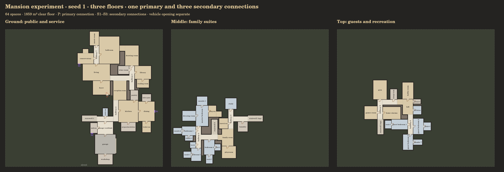

# Mansion experiment and house connections

Select **Mansion experiment (three floors)** in `space.html`. Selecting it now
enables the height/gallery study, with an L gallery overlooking the living
space. Choose its profile, lower room and floor rise, or disable heights for
the archived flat model. See [space-heights.md](space-heights.md) for physical
stairs, cutouts, height constraints and the `br.space/0.4` export. The experiment
uses the same reserved-floor placement and 0.15 / 0.30 m wall rules as the
existing shape studies. **Floor view** displays large floor plans stacked vertically for scrolling,
or a single level. Each level is cropped and scaled to its actual footprint; the JSON
retains shared building coordinates. Narrow viewports can scroll horizontally
instead of shrinking the plans. Labels wrap within actual floors and omit
secondary size text when it cannot fit. Secondary connections can be selected as **2**,
**3**, or **2–3 by seed**. Hall and living profiles remain available.



## Connection contract

The current house API loads `house.js` after `shapes.js`. Every generated house
exports a `connections` array referencing actual exterior openings:

| Role | Meaning | Mansion count |
| --- | --- | ---: |
| `primary` | Front-door role, opening into the house from outside | 1 |
| `secondary` | Other pedestrian connections leading out of the house | 2–3 |

Opening roles are `primary connection` and `secondary connection`. Original
opening roles are retained as `legacyRole` for compatibility with the older
checker and archived consumers. Vehicle garage doors remain separate; they
do not inflate the house connection count. Canvas markers show **P** and
**S1, S2, S3**; the sidebar lists their rooms, floors and clear widths.

The primary connection is on the ground floor. The main passage ends at a
top-floor secondary connection; another secondary is on the middle floor.
When the seed selects three secondaries, the third branches off the ground
floor. Secondaries belong to different public/service rooms. The entire room floor is reserved first.
Secondary openings are then placed on exposed floor edges with a clear
2.6 m approach reservation; clearance checks include concave parts of the
same room on the same level. Upper-floor openings are outward connection
ports for adjoining backrooms at that level; they do not add balconies,
outside stairs or destination floors. The front retains its clear approach, and vehicle access retains
its separate reservation. An independent output checker confirms exposed
edges, actual opening references and unobstructed approaches.

## Room program

The seed chooses a coherent subset of the mansion room pool, including:

- **Ground:** grand foyer, living and reception rooms, kitchen, formal dining,
  breakfast room, preparation kitchen, food pantry, butler's pantry, library,
  reading room, drawing room, powder room, garage vestibule, mudroom, garage
  and workshop. Ballroom, conservatory, sunroom, music and wine rooms are
  selected by seed. An optional pool group includes changing, shower, sauna
  and equipment rooms.
- **Middle:** a primary suite with dressing, ensuite and sitting rooms; three
  or four family bedrooms with dedicated ensuites; closets, family lounge,
  laundry, linen storage, study, playroom and homework room. Nursery is optional.
- **Top:** two or three guest suites with ensuites, loft, cinema, games room,
  gym, hobby room, storage and housekeeping store. Billiards, gallery,
  collection and staff rooms are optional.

There are two stair connections, ground–middle and middle–top. With height
mode off, each reserves 1.5 × 4.5 m clear floor independently of hall width. This is
the prototype stair envelope, not a detailed riser/headroom construction model.
Stair floors and room floors are reserved before walls. Every room must be
reachable from the primary connection. All three floors and the complete
selected program are required; a failed placement returns an error rather
than silently dropping a room. Upper-floor overhangs remain allowed under the
existing free-outline prototype rules; this experiment does not impose a
structural support model or a neighbourhood lot envelope.

## Functional relationships

**Room relationships** is enabled by default for current houses. Dining must
share a direct opening with kitchen on the same floor. Food pantries connect
to kitchen. If dining is already on the circulation sequence, kitchen is
placed directly against it. Otherwise dining is placed against kitchen before
unrelated rooms consume its available faces. Repeated kitchen/dining labels
created by the wrongness script become additional lounge space.

Mansions additionally enforce direct links for preparation kitchen–kitchen,
breakfast–dining, butler's pantry–dining, garage–vestibule, mudroom–vestibule,
workshop–garage, library–reading, bedroom–ensuite and the primary suite's rooms.
Pool, changing and sauna/shower/equipment relationships remain together.
Their floors are explicit; laundry stays on the family floor. Bedroom suites
cannot become the main circulation sequence.

New living cores grow in both dimensions, keeping large target areas from
producing narrow strips. L/alcove wings retain the shape study's construction
and area allowance. Mansion satellites prefer centered attachments to leave
other faces usable. Wider branch halls provide more room for large groups.
Small-room door clearance is separate from the hall's clear width.

Current default houses use the relationship solver, including rectangle-only
layouts when shape profiles are disabled. Seeded room programs and bedroom
counts remain; placement can differ from the archived bar/deep/route solver.
**Compare shapes** retains original placement on the left for existing
recipes. For mansion it compares straight/rectangle with selected shapes.
The relationship checkbox can restore archived placement for existing houses;
it is mandatory for mansion. A mansion follows the passage concept: consecutive
route rooms join through actual openings and stairs, the route starts at the
primary and ends at a top-floor secondary, and side-room groups cannot connect
two route steps to create a bypass. These conditions are independently checked.
Mansion dotted centrelines follow actual concave floors; secondary branch ports
do not replace the main passage endpoint. Other new-solver house overlays
remain hidden. The room graph and circulation sequence are exported.

```js
// Load core, recipes, space, route, shapes, house, heights, then render.
BR.SPACE.generate({recipe:'mansion',seed:1,secondaryConnections:3});
BR.SPACE.generate({recipe:'mansion',seed:1,
  shapes:{hall:'T',living:'alcove'}});
BR.SPACE.generate({recipe:'passage1',seed:1}); // functional relationships
BR.SPACE.generate({recipe:'passage1',seed:1,relationships:false}); // archived placement
```

Mansion search evaluates 60 candidates. If none completes the program, it
continues deterministically to the first complete candidate, with a hard cap
of 240 attempts. This depends on geometry and seed, never elapsed time. An
explicit site rejects layouts too large for its dimensions. The secondary
count control consumes the same program random draws, so it cannot change the
selected room list. Connection fitting may change which placement succeeds.

## Validation

`tests/space-house.test.js` covers 40 seeds of each of the seven existing
presets, 20 mansion seeds across four hall/living profile pairs, complete
program counts, functional adjacency, all three floors, aligned stairs,
connection counts and geometry, deterministic repeated generation, invalid
output mutations, explicit count controls and undersized-site rejection.
The follow-up sample checks the new passage endpoint, middle-floor connection,
compact stair dimensions, broken route links and forbidden side-room bypasses.
Renderer tests sample concave passage segments against actual floor rectangles.
All 280 current-house and 80 mansion profile/seed cases built and passed.
The full local suite passed 452 checks across 27 files; the final focused full
run adds the L-hall exit regression and exercises the final display controller. These are sample results, not a promise
that every possible seed will fit within the bounded search.

The real test-bed controller has a dependency-free DOM/canvas test including
recipe selection, connection controls, saved settings and individual floors.
The stacked production-renderer image above was inspected. The archived generation
and performance fixtures still run separately, preserving their original
geometry. This is a larger layout experiment, with no speed improvement claim.
