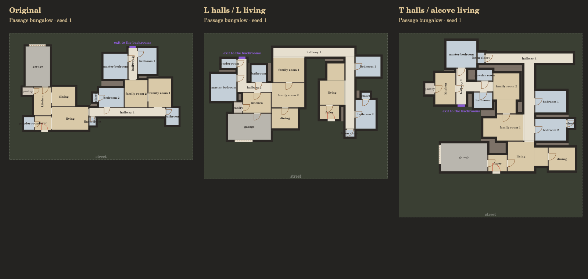

# Hallway and living-space shape experiment

The room-first test bed at `space.html` now includes **Shape experiment**, hall
and living profiles, and **Compare shapes**. Compare shows original and shaped
houses at the same seed; either generator remains available. The experiment
is separate from the neighbourhood/world engines.



## Profiles and floor geometry

| Room | Profiles | Construction |
| --- | --- | --- |
| Hall | straight, L, T, mixed | Joined rectangles, each arm at the recipe's clear hall width |
| Living, family, loft | rectangle, L, alcove, mixed | A usable rectangular core plus a 2.4 m deep side wing |
| Other rooms | rectangle | Existing seeded size candidates |

Living wings are 2.4 m wide for L rooms and 1.8 m for alcoves. A profile falls
back to a rectangle when its minimum core plus wing would exceed the target
area allowance (25% plus one grid step). Side branch halls remain straight.
Actual shapes appear in room labels and the room table.

The complete union of floor rectangles is reserved during placement. Rooms
on the same floor cannot overlap; facing floors are 0.15 m apart or at least
0.6 m apart. Entrance, exit and vehicle access reservations stay clear. Walls
are compiled from the floor union, with exposed boundary segments following
concave edges. Internal seams within one shaped room have no walls. Side-room
doors remain doors; route hall connections can open across the shared span.

Each shaped house exports `br.space/0.3`: `floorRects` are disjoint clear-floor
rectangles, `poly` is the actual simple concave boundary, and `area` is their
sum. `rect` and `size` describe bounding dimensions, which include the notch.
Rendering paints the rectangles and anchors text in the largest floor part.
Consumers must use the actual floors rather than treating `rect` as occupied.

## Generator and comparison

```js
// Load shapes.js after route.js. The option is deliberately opt-in.
BR.SPACE.generate({recipe:'passage1', seed:1,
  shapes:{hall:'T', living:'alcove'}});
BR.SPACE.generate({recipe:'passage1', seed:1}); // original output, unchanged
```

The shaped solver keeps the original seeded room program, including bedroom
counts and suite relationships, but uses a new placement search: 60 attempts,
compact bounding-area selection and short branch halls when needed. Legacy
bar/deep presets use a free outline in this experiment; their original fixed
lot layouts are retained in original mode. Explicit site dimensions reject a
shaped layout that is too large. Upper floors retain the existing permission
to overhang ground-floor space.

Some shaped attempts cannot place the complete room program. Generation then
returns an explicit error, without silently dropping bedrooms or reverting to
an original house. This is an experimental solver, not a speed replacement.
The comparison shows individual times; the 40-seed check uses the selected
shape profiles and reports build counts, verification counts and mean times.

The graph route remains exported and stairwells align between floors. The
old dotted overlay uses bounding-box centers, which can cross a concave notch,
so it is hidden for shaped houses pending an interior clearance-aware route.
Windows, furniture placement, diagonals and curved floors are future work.

## Validation

`node tests/run-all.js --full --jobs 4` includes geometry and controller checks.
The shape test covers all seven recipes, four profile pairs and seeds 1–20:
506 of 560 cases built; all built cases passed checks. Failures remain visible.
Checks include determinism, original-mode preservation, bedroom counts,
concave polygon area, connected floor parts, exact gaps, clear hall arms, room
and solid-floor overlap, lot bounds, room reachability and aligned stairs.
Mutation checks exercise incorrect area, a wall painted on a floor and a
cut-off graph. The real HTML controller is exercised with a DOM/canvas adapter;
the picture above was rendered with the production renderer and inspected.
