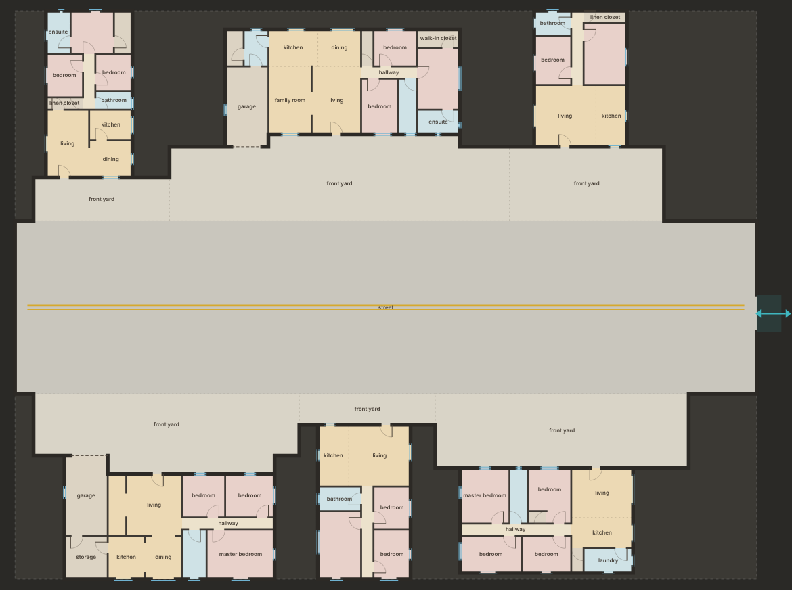

# Templates: blueprints for points of interest

Templates design the authored-feeling places (POIs) that sit inside the
backrooms. They range in size:

* **Small:** a one-room closet, a restroom, storage units.
* **Medium:** a house.
* **Large:** a neighborhood: houses lined up on both sides of a street in a
  big hall, each one built by the house template (section 8: templates inside
  templates).
* **Planned, not built yet:** a mall, a skyscraper or an amusement park.

A template outputs **architecture only**:

* rooms, each with a type and tags;
* walls;
* doors and windows;
* entrances and exits onto the surrounding backrooms (*portals*);
* vertical links between levels.

There is no furniture, terrain or outside dressing. A later tool furnishes
rooms from their types and tags.

```
site (allotted shape) + seed + archetype  ─►  engine  ─►  building JSON (br.building/0.2)
                                                          ├─► 2-D workbench / map
                                                          └─► Unreal: kit pieces from walls / openings, furnishing from room tags
```

Open `workbench.html` to browse, compare and debug templates (section 9).

## 1. Kit grid and frames

* **Kit grid: 0.5 m.** Every room edge, wall and opening edge is a multiple of
  0.5 m, so an Unreal modular kit built on 0.5 / 1 / 2 / 4 m pieces lines up
  exactly.
* **Walls are centre lines.** Rooms are measured boundary to boundary.
  Suggested thickness comes with each wall: exterior 0.3 m, interior 0.15 m.
* **Site frame.** The origin is the site's bounding-box corner. +x goes right
  and +y goes down (the same as the map).
* **Turning to the main side.** Engines design in a canonical frame with the
  main side at the bottom. The framework turns the result to face the
  requested `approach`.

## 2. Input: the site

The world allots each POI a **site**: any rectilinear shape (a rectangle, an
L, a U, a notched block). The template builds inside it.

A template uses its site almost to the edge. Whatever sits round it is not
the template's job: on the map that is its lot's yard, or the filler it sits
inside (section 4 and [docs/world.md](world.md)). The only breathing room a
template asks for is each portal's `clear` depth: the floor the world must
keep open in front of a door.

```js
BR.TPL.generate({
  archetype: 'ranch',                         // id, or a recipe object
  seed: 1234,                                 // uint32
  site: { w: 26, h: 15 },                     // metres; or { rects: [[x0,y0,x1,y1], ...] } for any shape
                                              // (default: drawn from the recipe's site ranges)
  approach: 'S',                              // the side the main entrance faces: N | E | S | W
  wrongness: 0.5,                             // optional 0..1, overrides the recipe
  mutations: ['falseDoors'],                  // optional, forces specific mutations
  candidates: 36,                             // optional: layouts tried
  flush: false                                // optional: the site edge is the lot edge, so the
                                              // building fills it and its doors sit on the edge
})
```

The result is deterministic: the same spec gives the same building, whatever
was generated before. If nothing fits, the result is
`{ error: 'no valid layout', meta: { layoutFailures } }`; the world can then
try another site or another template. A recipe's `site` ranges tell the world
what to allot.

## 3. Output: `br.building/0.2`

Lengths are in metres in the site frame. Ids are stable within a building.

| field | content |
|---|---|
| `schema, engine, archetype, name, seed, approach, grid` | identity |
| `site` | `{ w, h, rects }`: the allowance |
| `levels[]` | `{ index, elevation, height }`; there is at least one |
| `footprint[]` | `{ level, rects }`: built cells per level |
| `rooms[]` | `{ id, type, name, zone, level, rects, area, ceiling, tags, parent, part? }`. `zone`: public, private, service or circulation. `tags` describe what the room is for (`kitchen`, `wet`, `sleeping`, `storage`, `vehicle`…, plus `wrong:*` for mutations). `parent`: the owning room of closets, ensuites and stalls. `part`: in a composite template, the part (`parts[]`) the room belongs to, `null` for the composite's own rooms |
| `walls[]` | `{ id, level, kind, a, b, rooms [idA, idB], thickness }`. `kind`: `exterior` (one side is the backrooms; that room id is `null`), `interior`, `open` (a boundary with no wall), `facade` (in a composite template: a part's outer wall against the composite's own rooms, such as a house front onto its yard; both room ids are set, thickness as exterior) |
| `openings[]` | `{ id, level, wall, kind, a, b, width, rooms, swingInto, hinge, height \| sill+head, portal, part?, tags? }`. `kind`: `door`, `double`, `opening` (cased, no leaf), `slider`, `vehicle` (garage/roller door), `window`, `false` (a door on a wall that leads nowhere). In a composite, `part` names the part it came from, and a part's former portal keeps its tags (`front door`, `garage door`) |
| `portals[]` | `{ id, opening, level, room, role, kind, side, width, clear, main, tags }`. Where the POI meets the backrooms. `role`: `entrance`, `exit` or `both`. `main` marks the main entrance. `clear`: metres of open floor the world must keep in front |
| `verticals[]` | `{ id, kind, rooms: [bottom → top], dead, tags }`: stairs, lifts, ladders linking stacked rooms. `dead: true` means it leads nowhere (a mutation) |
| `graph` | `{ nodes: [room ids, 'outside'], edges: [[a, b, kind, opening id], ...] }`. Edge kinds: the opening kinds, `open`, and vertical kinds |
| `parts[]` | composite templates only: `{ id, archetype, engine, name, label, approach, site: { rects }, score, mutations, rooms: [ids], doors: [opening ids], spec }`, one per template built inside it. `spec` is exactly what built it, so `TPL.generate` on that spec alone gives the same building (section 8) |
| `meta` | `plan, score, terms, candidates, valid, chosen, mutations, program, issues, autoDoors, layoutFailures, ms`. This is debug information, not part of the building |

Guarantees, checked by `tests/templates.test.js`:

* everything is on the kit grid;
* rooms lie inside the site and never overlap on a level;
* openings lie on their walls, and portals on exterior walls;
* there is a main entrance facing `approach`;
* every room can be reached from the outside through the graph, across levels
  too;
* no furniture or terrain fields appear.

### How the world uses it

* **Placement.** The world places the POI and builds it first. Its footprint
  comes out of the site round it, and its exterior walls become the boundary.
* **Routes.** Every ground-floor portal becomes one of the connections of the
  site round it (the yard, or a filler), so that site cuts an opening in
  exactly that place. On a flush lot the portal is the world's connection.
* **Clearance.** Keep each portal's `clear` box open.

## 4. Lots: how a template meets the world (`src/tpl/lot.js`)

Every template takes connections on its site edges, the way fillers do. A
template sits in the world in one of three settings:

* **yard**: its own lot, with a setting its recipe designs. Houses get a
  front yard and nothing else: solid round the back and sides of the house,
  a strip across its front a little wider than it (so the house stands half
  way into it), and a lane from the strip out to the lot edge, where the lot
  meets the rest of the backrooms. A door off the front gets a short passage
  through the solid to the lot edge. The yard is sized by the biome.
* **flush**: its own lot and nothing else. The door is the edge: the
  template is built with `flush: true`, fills its site, and the world puts its
  connection exactly on the template's door. Only templates at least one
  block (8 m) across both ways may be flush.
* **inside**: inside a bigger template. A template smaller than a block goes
  in a filler's site. The filler builds round it and takes its doors as
  connections.

`LOT.setting(archetype)` is the recipe's setting: `archetype.setting` if it
sets one, else a yard for houses and flush for the rest (which the world
turns into inside when the template is smaller than a block).

A house's lot is sized round the house once it is built:

```js
const b = BR.LOT.template({ archetype: 'ranch', seed: 99, approach: 'S', rects: [[0, 0, 24, 14]] });
const m = BR.LOT.margins(BR.TPL.archetypes.ranch, rng, openness);   // { front, side, back, apron, reach, wrap, laneW }
const Y = BR.LOT.yard(b, 'S', m);
// -> { w, h, origin (the house's frame in the lot), yard: [rects], doors: [{ portal, side, o, c, s0, s1, main, adapter }], into: [portal ids] }
```

`yard` is the front yard (strip and lane). `doors` are the doors that meet
the lot edge: each has an `adapter`, the passage from the door straight out
to the edge, where the world puts its connection. `into` are the doors that
open onto the yard.

`LOT.build` is the connection adapter:

```js
BR.LOT.build({
  seed: 1234,
  site: { rects: [[0, 0, Y.w, Y.h]] },        // metres, the surrounding site
  filler: 'yard',                             // or a pool filler; picked from the pool when left out
  connections: [{ id: 'n1', side: 'S', at: 12, width: 2, line: Y.h }],   // the site's edge connections
  buildings: [{ id: 0, b, origin: Y.origin, edge: {} }],   // or { id, archetype, seed, approach, rects } to build it here
  hint: { yard: Y.yard, adapters: Y.doors.map((d) => d.adapter) }      // the yard filler's hint
})
// -> { schema: 'br.lot/0.1', site, setting (br.filler), at, buildings: [{ id, origin, b, conns }], conns, issues, ms }
```

1. Each building is given built (`b`, with its `origin` in the site), or is
   built here by its own template (`LOT.template`, three seeds).
2. Its footprint, and any courtyard it closes off, leave the surrounding site.
3. Each ground-floor portal becomes a connection of the surrounding site
   (`P{id}:{portalId}`), at the exact place and width of the door, unless
   `edge` maps it to one of the site's own connections (a door on the site
   edge).
4. The surrounding filler honours those and the site's own edge connections.
   Where one lands on solid, the filler carves a passage to the nearest floor.
   It works in the frame of what the buildings leave; `at` is where that
   frame's origin sits in the site.

The workbench shows templates in their setting (section 9). Where a
template and the filler round it end up wall to wall, the shared wall is a
seam, recorded once, and seam rules may cut a window or door through it
([docs/world.md](world.md#seams-where-blueprints-meet-srcseamsjs)).

## 5. Entrances and exits are template-specific

Each engine and recipe decides its own portals:

* **House:** a front door (main entrance, sometimes double), a garage door
  (`vehicle`, both ways), maybe a back exit (a door, or a slider from
  living/dining), maybe a side exit.
* **Restroom:** a single way in and out.
* **Mechanical room:** an entrance, and often an exit straight through the
  other side.
* **Storage units:** a double-door entrance and a fire exit at the far end.

Room-engine recipes list them as data:

```js
portals: [{ role: 'both', kind: { door: 0.6, double: 0.4 }, side: 'S' },   // the main side; kind drawn from weights
          { role: 'exit', kind: 'door', side: 'flank', p: 0.3 }]         // 'back' | 'flank' | 'any', with a chance
```

## 6. Pipeline (`src/tpl/framework.js`)

1. **site.** The allowance becomes a canonical mask, with its largest inner
   rect.
2. **program.** `engine.program(recipe)`: what to build.
3. **candidates.** `engine.layout(program)` runs N times (default 36). Each
   run returns rooms per level, wanted connections (to rooms, or to
   `TPL.OUTSIDE` for portals) and verticals.
4. **quick score.** `engine.quickScore` makes cheap checks.
5. **resolve.** The best K (default 6) candidates are resolved:
   * walls per level, from a raster of rooms;
   * explicit connections first, then `engine.connRule` for adjacent pairs;
   * portals on the exterior walls of the requested side;
   * reachability from outside through portals and verticals, with doors
     added (`engine.autoPenalty`) wherever a room would be cut off;
   * `engine.postResolve` (mutations such as false doors);
   * windows from each room type's rule (recipe `windows: 0..1`).
6. **score and validate.** Generic penalties (sizes, proportions, missing
   windows, circulation share, extra doors, missing links) plus engine terms.
   Score = 100 − penalties. The best valid candidate wins.
7. **output.** Units become metres, and the building turns to face the main
   side.

## 7. Engines and recipes

An **engine** is code: the architectural logic of one family. It registers
with `BR.TPL.registerEngine({ id, name, types, mutations, program, layout,
quickScore, score, connRule, autoPenalty, postResolve, fallback })`. `types`
is its room catalogue: zone, minimum width, maximum aspect, door privacy,
window rule, ceiling range and tags.

Current engines:

* **`house`** (`src/tpl/house.js`): public / private / service zones and
  plan types bar, T, L, deep and split.
  * The public zone is cut by recursive slicing, entry rooms toward the main
    side and service rooms toward the garage.
  * The private wing searches hall position, master endcap and side
    assignment. It produces an ensuite and walk-in closet around a vestibule,
    plus reach-in closets carved beside bedroom doors.
  * A garage comes with a service room behind it.
  * Portals as above.
* **`neighborhood`** (`src/tpl/neighborhood.js`), the first composite
  engine (section 8): a street down a hall with houses along both sides,
  every house built by the `house` engine.
* **`room`** (`src/tpl/room.js`), the small end of the range. Layouts:
  * `single` (closet, storage room);
  * `stalls` (restroom: vestibule, washroom, stall row, janitor closet);
  * `L` (an L-shaped plant room);
  * `units` (a corridor with rooms either side and an exit at the far end).

A **recipe** (archetype) is pure data in `src/tpl/archetypes/`:

* the `site` ranges;
* rooms with counts, chances and m² ranges;
* plan weights;
* portal chances;
* `windows`;
* `wrongness`;
* `category`, `blurb` and `rarity`, which the workbench uses.

A new house type is a new recipe:

```js
BR.TPL.registerArchetype({
  id: 'cottage_small', engine: 'house', name: 'Small cottage', category: 'house',
  site: { w: [9, 12], h: [12, 16] }, plans: { deep: 1 }, depth: [8, 10],
  rooms: { living: { area: [14, 18] }, kitchen: { area: [8, 10] }, master: { area: [11, 13] }, bath: { area: [4, 5] } },
  backDoor: 0.8, windows: 1, wrongness: 0.2
});
```

**Bigger POIs** use the same contract:

* a skyscraper is several `levels` with stacked stair and lift `verticals`
  (the tests build one with a test engine);
* a street of houses is a composite engine that runs child templates inside
  sub-sites and merges them (the neighborhood, section 8); a mall will be
  another.

### Wrongness

| engine | mutations |
|---|---|
| house | `twin` (a room repeats), `giant` (one room far too big), `endless` (the hallway keeps going), `windowless`, `stairs` (a staircase into the ceiling), `falseDoors` (doors onto walls), `ceiling` (a ceiling at the wrong height) |
| room | `falseDoors`, `ceiling` |
| neighborhood | `twins` (every house is the same house), `vacant` (one lot stands empty); each house also draws its own |

Each mutation is tagged in the output (`wrong:*`), so a client can play it up.

## 8. Templates inside templates (`src/tpl/composite.js`)



A **composite** engine builds nothing itself. It cuts its site into
sub-sites, has other templates build them, places what comes back and adds
its own rooms round them. The shared pipeline then merges all of it into one
ordinary `br.building/0.2`, so the world, the map and the workbench use it
like any other template.

An engine is composite when it registers with `composite: true` and a `plan`
in place of `layout`. `TPL.generate` hands it to `TPL.compose`:

1. **Site, program, mutations** as for any template.
2. **Plan.** `engine.plan(program, ctx, rng, kit)` builds its children with
   `kit.child({ archetype, override, seed, rect, approach, wrongness })`: a real
   `TPL.generate` of that template on that sub-site (in the composite's
   canonical frame), tried on three seeds and cached within the call.
   `override` is laid over the child's recipe, so a template is reused as it
   is with only what the setting needs changed. The plan returns its own rooms
   (units), the parts (`{ b, at }`: each child and where its site frame
   sits), its own portals, and which of its own boundaries are open. A few
   candidates are tried; the first valid one is kept.
3. **Merge.** One raster of every room gives the walls. A child's own walls
   keep their kind; a child's outer wall against the composite's rooms is a
   `facade`; anything against the solid is `exterior`. Every child opening
   goes back on its wall, windows included. A child's portals (the doors it
   chose onto "the backrooms") become doors onto whatever room the composite
   put in front of them, and keep their tags. The child's room graph is
   carried over, renumbered.
4. **Validate.** Rooms inside the site, no overlaps, no child door onto solid
   or back into its own building, an entrance, every room reachable from the
   outside.
5. **Score.** The children's mean penalty, plus the engine's own terms.
6. **Output.** Metres, turned to face the main side, with `parts[]` (section
   3).

The guarantee, checked by `tests/neighborhood.test.js`: every part is
exactly what its template builds alone from `parts[k].spec`.

### The neighborhood

`neighborhood` (`src/tpl/archetypes/neighborhood.js`), after the reference of
a suburban street indoors: a street 8–14 m wide runs from the entrance on the
main side to the far end, under a 9–14 m hall ceiling. Along each side, lots
are packed from the far end; each lot's house template is drawn from the
recipe's `houses` weights and its frontage from that template's own site
range. Each house is built with the recipe's `child` overrides (no back or
side doors, so every door it chooses is on its front), faces the street, and
is pushed back against the hall wall, leaving a front yard of 2–6 m. The yard
runs from the street up to the house, into any recess, and alongside it up to
its front, so every door the house chose opens onto it; the rest of the row is
solid. The entrance is a wide opening or double doors on the main side, and
half the time there is a door out at the far end.

A house that will not build on its lot is tried on more seeds, then as the
recipe's smallest house; if nothing fits, the lot stands empty. The
neighborhood needs at least one house on each side.

| recipe field | what it sets |
|---|---|
| `houses` | house recipes that line the street, by weight |
| `child` | fields laid over each house recipe (`backDoor: 0, sideDoor: 0`, a little `wrongness`) |
| `street`, `row`, `rowMin` | street width; the depth of each row of lots the street is sized round; the shallowest row worth trying (m) |
| `apron`, `yardMax` | the least front yard, and the most once the house is pushed back (m) |
| `gap`, `perSide` | between neighbouring lots (m); the most houses on a side |
| `mouth`, `farEnd` | clear stretch at the entrance and at the far end (m) |
| `gate`, `gateKind`, `farExit`, `farWidth`, `farKind` | the entrance, and the chance, width and kind of a way out at the far end |
| `ceiling` | the hall's ceiling over the street and yards (m) |

The street is tagged `street`, so the renderer paints a double centre line
down it; fences, mailboxes and the stop sign are for a furnishing pass. A
neighborhood is about 40–52 × 40–64 m, the `large` tier: on the map it is a
flush lot of its own, joined to the backrooms only through its entrance and
far door.

## 9. The workbench (`workbench.html`)

**Library (left):**

* search across name, engine, category and text;
* filter chips by engine and size class (tiny / small / medium / large /
  huge), plus favourites and "needs work";
* sorting by engine, name, health or size.

The *Fillers (Backrooms)* group lists the filler pool (docs/fillers.md).
Fillers use the site and connection controls; they have no score, so their
cards and side panel show what they built instead.

*Check health* builds every listed template on 12 seeds. Each one then shows
a coloured dot, its average score, how often it found no layout, and its
most common rejection. Use it after editing many recipes.

**Modes:**

* **Seeds:** one template over a page of seeds.
* **Compare:** the ticked templates as rows on the same seeds and the same
  site.
* **Gallery:** one card per listed template.

**Site controls:** archetype-size or fixed W×D, a shape (rect, L, U, notched,
random), the main side and the wrongness level (templates), and the
connections, by count or exactly (fillers and lots).

**Setting** (templates):

* **its own lot**: the template in its own setting, as the world places it. A house
  stands behind its front yard, with connections at the end of its lane and of
  its doors' passages; a block-sized template is flush, its doors on the edge.
* **inside a filler**: the template inside a filler from the pool, 3–9 m of site
  round it, with the filler taking its doors as connections. The detail
  panel counts the seams (shared walls) and what the seam rules cut through
  them; they are drawn on the cards.
* **template only**: the template alone, as `TPL.generate` builds it.

**View options:**

* room labels, with sizes or tags;
* portals: arrows in for entrances and out for exits, plus the clearance box;
* the room graph;
* a blueprint theme;
* crop to the footprint.

**Detail view** (click a card):

* pan and zoom; hovering a room of a composite names the part it is in;
* level tabs;
* tabs for score breakdown and rejections, rooms with tags (grouped by part
  in a composite), portals, program (with the parts of a composite), issues,
  and the JSON (copy or download).

**Recipes:** *Edit recipe* changes a recipe live. *Save as new…* forks it into
a new template in the library, which is the fastest way to grow the catalogue.

**Keys:**

* `/` search;
* `↑` `↓` switch template;
* `←` `→` page seeds;
* `1` `2` `3` modes;
* `c` compare;
* `f` favourite;
* `Esc` close.

## 10. Next

* **More house recipes and logic:** shotgun, duplex, courtyard, two-storey
  (with levels).
* **Use the leftover arms of irregular sites.** For example, push a garage or
  a wing into the free arm of an L-shaped site.
* **More composite engines:** a mall, then a tower engine. For the
  neighborhood: alleys between houses out to the hall wall, back doors that
  open onto them, and a cul-de-sac or a crossroads; a neighborhood that
  claims across cells (`huge`).
* **Entrances from connections.** Today a template picks its own doors and
  the yard, the filler round it or the world's graph adapts. Next, House and
  Rooms take their entrances from the connections they are given, as fillers
  do.
* **More designed settings.** Today only houses have one (the yard). A
  restroom could sit off a corridor, storage units at the end of a passage.

The world reads three optional recipe fields when it places POIs: `weight`
(frequency within the size tier), `poi: false` (keep the template out of
the world) and `setting` (section 4). See [docs/world.md](world.md).
