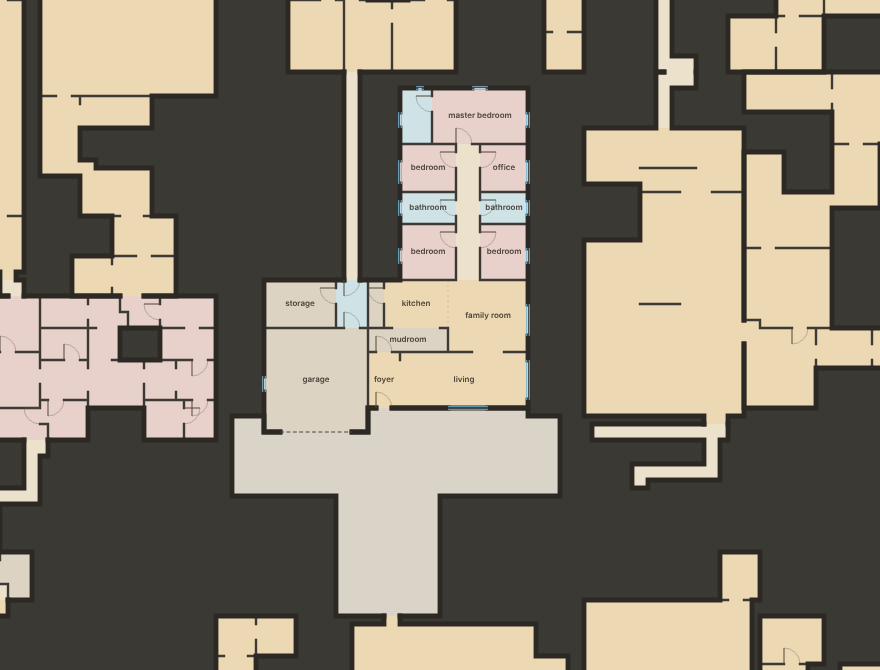
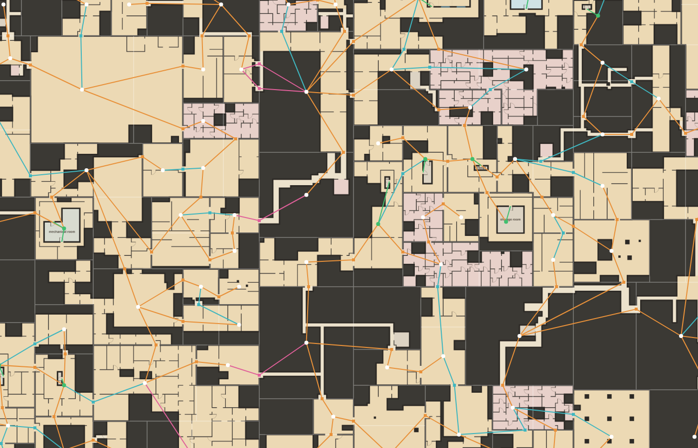

# The template-first world

Every site on the infinite plane is built by a template from its outline and
its connections. Nothing else draws floor or walls. Plain Backrooms sites are
built by **fillers** ([docs/fillers.md](fillers.md)). Points of interest are
built by their own **templates** (House, Rooms; [docs/templates.md](templates.md)),
and each one sits in the world in one of three ways (`src/tpl/lot.js`):

| setting | what | who |
|---|---|---|
| **yard** | its own lot: solid round the back and sides of the house, and only a front yard: a strip across the front of the house, a little wider than it, and a lane from the strip out to the lot edge, where it meets the rest of the backrooms | houses |
| **flush** | its own lot and nothing else. The door is the edge: the world puts its connection exactly on the template's door | templates at least one block (8 m) across both ways, a neighborhood included |
| **inside** | inside a filler's site. The filler builds round it and takes its doors as connections | templates smaller than a block |

So a house stands half way into a room of its own with the dark close behind
it, like the lone house in a concrete hall, and a closet never claims a block
with solid round it.





*Orange is the route (a spanning tree), cyan the loops, pink the openings across
a cell border, and green a POI's doors onto the site round it. Green dots are
lots.*

The old world-first fill is gone: its areas, manifestations, patterns, zones,
traversal, interiors and boundaries, along with the offices, pools, parking and
hotel areas. The map is Backrooms only.

## A cell's plan (`src/world.js`)

The plane is cut into 128 m cells. Each cell is planned from `(seed, i, j)` and
its four borders alone. It never looks at another cell's plan, so any part of
the map comes out the same in any order.

1. **Borders.** Every cell border has 2–4 openings, 1.5–2.5 m wide and at least
   8 m from the corners. The border decides them by itself, so the two cells on
   either side agree without asking each other.
2. **POIs.** POIs claim their places first (`src/poi.js`, below): houses on
   yard lots, block-sized templates on flush lots, smaller ones inside what
   will be filler sites. Houses and flush buildings are built now: a house's
   lot is sized round what was built, and a building's doors decide where the
   world's connections go.
3. **Blocks.** Every lot is cut out along its own edges first. The rest of the
   cell is cut into blocks of 8–32 m, in whole metres, by recursive cuts. A cut
   keeps a block's width (8 m) from a lot, 2 m from a POI inside a filler, and
   1 m from any opening that must not be cut (border openings and lot
   doors). So every lot is a block of its own, every small POI sits whole
   inside one block, and every border opening lies inside one block's edge.
4. **Sites.** About 30% of the small blocks merge into a neighbour, making L, T
   and Z sites (up to 900 m² and 40 m). A lot's block never merges. Every block
   belongs to exactly one site, so a cell has no gaps and no overlaps. A flush
   lot the cuts could not free (rare) is left out.
5. **The connection graph.** Two sites are neighbours where they share an edge.
   A random spanning tree over the neighbours is the route, and each other
   neighbour pair is opened as a loop with 10–30% chance (more in open
   stretches). Each edge is an exact opening on the shared line: 1–3 m wide, at
   least 1 m from the ends of the shared run, on the 0.5 m grid. Lots have two
   rules:
   * a **yard lot** meets its neighbours only where its front yard reaches the
     lot edge (the end of its lane) and at the end of each door's passage. The
     lane is always joined to the neighbour across it, even when a door
     joined the two already, so a house is always entered from the front.
     The lane has walls of its own, so there a connection may run to 0.5 m
     from the ends of the shared run;
   * a **flush lot** is joined only through its own doors, each one an exact
     connection on the door, joined to whichever site is on the other side.

   A lot's door counts towards the spanning tree only if the building links
   that door to its front without leaving it (the main door, or any door onto
   the front yard, `frontJoined`). A house can reach some rooms only through
   another door, such as a garage wing behind the garage door; the site
   across such a door still gets a way in of its own, so the room graph
   stays one piece.

   The border openings join each cell to its neighbours, so the whole plane is
   one connected graph. It is route-shaped: mostly chains, with branches, dead
   ends and a few loops.

Measured over 8 × 8 cells for three seeds:

| | per cell |
|---|---|
| sites | 76–79 (median filler site about 150 m²; 10% are 80 m² or less, 10% over 400 m²) |
| irregular sites | about 27% |
| POIs | 5.5–7.5: 1.1–1.4 houses in yards, 0.15–0.25 on flush lots, 4.3–5.8 inside fillers |
| yard lots | median 410–480 m² (10% under 250–300 m², 10% over 610–690 m²) |
| connections | about 106, of which about 12 cross a border; about 20% are loops |
| plan | 15–22 ms, houses and flush buildings included |
| build | 160–200 ms (2–2.6 ms per site) |

## Building a site

`W.build(site)` returns the site's blueprints. It is cached, and the result
depends only on the site.

* **A filler site.** The biome's weights pick a filler from the pool
  (`FILL.pick`). The filler builds the site from the site's connections, given
  in its own frame.
* **A yard lot.** The house was built with the plan, and its lot sized round
  what was built (`LOT.yard`): 1 m of solid behind the house, 2–3 m beside
  it, and 4–12 m in front. The front yard is one room: a strip 2–4 m deep
  across the front of the house, reaching 1–2 m past each side and 1 m back
  along them, so the house stands half way into it, and a lane 4–7 m wide
  from the strip out to the lot's front edge, in front of the main door. The
  biome's openness sizes them all (`LOT.margins`). A door off the front gets
  a passage (an adapter) straight out through the solid to the lot edge, and
  the world's connection sits at its end. `LOT.build` takes the house's
  footprint out of the lot, and the `yard` filler paints the front yard and
  the passages it is given as a `hint`, honouring the lane's connection and
  every door that opens onto the yard. The rest of the lot is solid. The
  filler works in the frame of what the house leaves, so the build says
  where it sits (`fillerOrigin`).
* **A flush lot.** The building alone. Its doors are the site's connections,
  so there is nothing to adapt.
* **A filler site with small POIs inside.** `LOT.build` builds them first,
  their footprints come out of the site, and every ground-floor portal becomes
  one more connection for the site, at the exact place and width of the door.
  The pool's filler builds round them and honours their doors. Where a door
  lands on solid, the filler carves a passage to the nearest floor.

This is the rule from the design notes: the more specific template places the
shared opening, and the other side adapts. Templates still choose their own
doors; the yard, the filler or the world's graph honours them.

Before building, every connection is checked against the site
(`FILL.checkConnection`). A connection the site cannot honour is dropped and
reported in `issues`. None was dropped over about 15,000 sites (5 × 5 cells
on eight seeds), and a 1 m walker reaches every floor cell of every one of
them from its connections.

Cells a filler leaves unbuilt are solid. About three fifths of the plane is
floor. A quarter to two fifths of that floor is in rooms of 80 m² or more
(open halls); the rest is the enclosed warren.

## The biome

One slow noise field, **openness** (0 to 1, on a 380 m scale), tilts the
filler weights and sets how big blocks may grow (18 m in a deep warren up to
32 m in an open stretch):

| feel | weight multiplier |
|---|---|
| enclosed (warren, passage, enfilade, cells, ring) | 1.3 − 0.6 × openness |
| mixed (broken room) | 0.5 + openness |
| open (ragged hall, pillar hall) | 0.15 + 2.2 × openness |

Even in an open stretch, enclosed fillers have about half the weight. Over a
region, enclosed fillers cover 64–77% of the filler area, mixed 18–25% and
open 5–10%. Hover the map to see a place's biome: *deep warren* (under 0.3),
*backrooms*, or *open stretch* (over 0.7).

## POIs (`src/poi.js`)

POIs are decided per 128 m cell (the same grid), from `(seed, i, j)` only.

* **Settings.** A house goes in a yard. Any other template at least 8 m both
  ways is a flush lot, and a smaller one goes inside a filler (`LOT.setting`;
  a recipe can set its own `setting`).
* **Yards.** The house is built when its cell is planned, facing its main
  side, and its lot is sized round what was built (see *A yard lot* above):
  tight in a deep warren, bigger in an open stretch.
* **Spacing.** A lot stays 8 m inside its cell and 8 m from other lots, so the
  world can always cut it out as a block of its own. A POI inside a filler
  stays 3 m inside its cell, 4 m from other POIs and 10 m from lots.

| tier | per hectare at density 1 | clusters | templates |
|---|---:|---:|---|
| tiny | 2.0 | 55% beside a bigger POI (not one in a yard) | closet |
| small | 1.8 | 45% | storage room, restroom, mechanical room, storage units |
| medium | 0.9 | | ranch, bungalow, split ranch, suburban |
| large | 0.04 | | neighborhood hall (about one in 25 cells), on a flush lot |
| huge | 0.004 | | none yet |

* **Rhythm.** A slow field (420 m) sets each cell's density between 0.3 and
  1.7, and 12% of cells are quiet (at 0.15 of that). This gives about 3–4 POIs
  per hectare, with long empty stretches.
* **Sites.** A POI's site is sized from its template's own ranges, in whole
  metres, and faces N, E, S or W. When its short side is at least 12 m it may
  be irregular: rect 50%, L 22%, notched 16%, U 12%. The extra band sits
  behind the template's rectangle, so the template never loses the room it
  asked for. A flush lot is always a rectangle.
* **Hooks.** `archetype.weight` sets a template's frequency within its tier,
  and `archetype.poi = false` keeps it off the map (workbench only).

Every number is in `BR.POI_CFG` and `BR.WORLD_CFG`.

## Drawing (`src/render.js`)

The map is drawn into cached 256 px tiles at zoom levels 2^(k/2). Each frame
blits them and spends a 14 ms budget on the missing ones, nearest first.

| zoom | view |
|---|---|
| 1 px/m and closer | **Detail.** Every site's blueprints: the filler or yard, then any POI buildings. All floors are drawn before any walls, so neighbours never paint over each other's walls. POI room labels appear from 7 px/m. |
| 0.12–1 px/m | **Plan.** The cell plans alone, with nothing built. Each site is a flat tone, lots are picked out, and POIs are drawn as their sites. |
| under 0.12 px/m | **Far.** A raster of the biome and the POI density. |

The per-frame overlays are hover (the site's outline), *Site outlines* and
*Connection graph*.

## API

```js
const W = new BR.World(31337);
W.cell(i, j);              // { i, j, rect, density, openness, pois, lots, borders, blocks, sites, conns, byId, connById }
W.sitesIn(x0, y0, x1, y1); // sites whose bbox meets the rect
W.siteAt(x, y);  W.site('0,0:12');
W.fillerOf(site);          // the filler the pool picks for it ('yard' for a yard lot, null for a flush lot)
W.build(site);             // { site, origin, filler (br.filler, or null), fillerOrigin, buildings: [{ poi, origin, b (br.building), conns }], conns, issues, ms }
W.peer(site, conn);        // the site on the other side of a connection
W.graph(i0, j0, i1, j1);   // the room graph over those cells: { nodes, edges, dangling }
W.poisIn(x0, y0, x1, y1);  W.poiAt(x, y);
W.biomeAt(x, y);           // { openness, name }
```

* A **site** is `{ id ('i,j:k'), i, j, k, kind ('filler' | 'lot' | 'flush'),
  rects (world metres), bbox, area, lots, pois, seed, openness, conns (ids) }`.
* A **lot** is `{ id, kind ('yard' | 'flush'), rect, approach (its front),
  pois, portalConns (door portal → connection id) }`; a yard lot also has
  `yard` (its front yard rects) and `doors` (the doors that meet the lot edge,
  each with its `adapter` passage). A **POI** carries its `mode` (`yard`,
  `flush` or `inside`) and, on a lot, the lot's id in `lot`; a house's
  `origin` is where its building's frame sits.
* A **connection** is `{ id, o ('h': the line y = c, 'v': x = c), c, s0, s1
  (world metres along the line), a, b (sites; a is west or north of b), route,
  cross }`. A border connection has the other cell's site as `null` and names
  that cell in `peerCell`; both cells use the same id.
* A **filler's portals** carry the connection id they honour. A POI's portals
  are mapped in `build(site).buildings[k].conns`: inside a yard or a filler to
  the ids `LOT.build` gave them, and on a flush lot to the world's own
  connection ids. `W.graph` joins blueprints through those ids.

## Tests (`tests/world.test.js`, five seeds)

* Sites tile every cell exactly, with no gaps or overlaps, in whole metres.
  Ids are unique. Filler sites are room-cluster sized, and some are irregular.
* Each POI has the right setting: houses in yards, block-sized templates
  flush, smaller ones inside fillers. Every lot is cut out as a site of its
  own. A flush lot is joined only through its own doors; a yard lot only at
  the end of its lane and of its doors' passages, and always from the front.
  Small POIs sit whole inside fillers, 2 m clear of the edges.
* Every connection is an exact opening on the line its two sites share. Both
  cells agree on every border opening. Each cell is one connected graph,
  route-shaped.
* The plan is the same in reverse order, after unrelated visits, with a tiny
  cache and at far negative coordinates. Another seed gives another world.
* Every site in 3 × 3 cells builds with no problems, and a 1 m walker gets to
  every floor cell from the site's connections. Every connection is cut on
  both sides, POI doors included. Every POI builds inside its site, facing its
  main side. A house has solid round its back and sides, and its yard only in
  front (beside it, no more than 1 m back from its front, or in front of a
  door). The fill leans enclosed, and sites build in under 5 ms on average.
* Every room in 3 × 3 cells, POI rooms included, is reachable from every
  other, also round a house whose wing is reached only through another door.
  Only openings that leave the region are left dangling.
* A site builds the same whatever was built before, and a filler site matches
  `FILL.generate` on its own spec.
* POI density, variety, clusters and rhythm, and the biome's range.
* Planning a cell stays under 60 ms, its houses included.

## Next

* House and Rooms take their entrances from the connections they are given,
  instead of choosing doors that the yard, the filler or the graph then
  adapts to.
* Settings designed for more POIs: a restroom off a corridor, storage units
  at the end of a passage. Today everything but a house is flush or inside.
* A door off a house's front takes a straight passage out to the lot edge,
  however far that is; a shorter way round the house would read better.
* Dressing for the front yard (a lawn, hedges, a painted sky on the far
  wall).
* Big POIs that claim across cells (a longer street in a hall, a mall). The
  cell plan already keeps POIs whole; a claim across a border needs the border
  openings to make way for it.
* More fillers and biome families, and wrongness for fillers.
* Shared walls drawn once. Today both sites draw the same line, which looks the
  same but is drawn twice.
